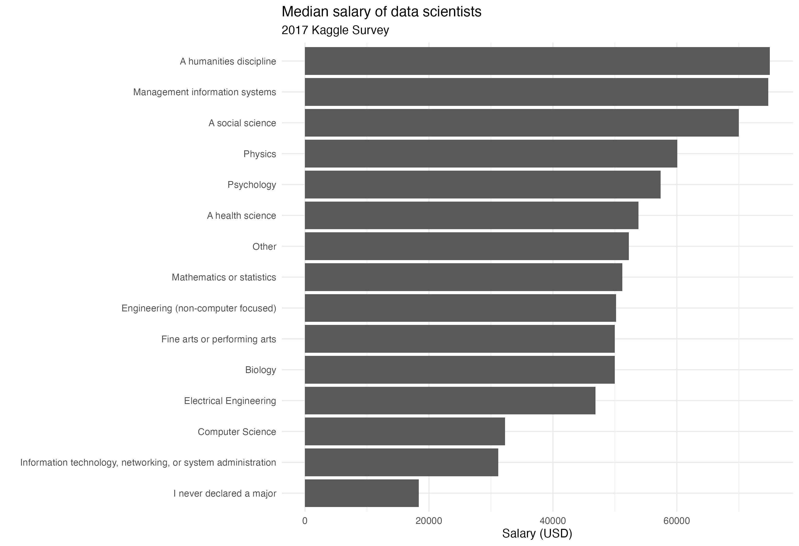

<div class="title-logo"></div>

```{r packages_setup, echo=FALSE, message=FALSE, warning=FALSE}
knitr::opts_chunk$set(echo = T, warning = F, message = F)
knitr::opts_chunk$set(fig.width=8, fig.height=6) 
```


```{r}
library(tidyverse)
library(nycflights13)
```


In 2017, the Kaggle platform ran an industry-wide survey to establish a comprehensive view of the state of data science and machine learning. The survey received more than 16,000 responses and shed light on who is working with data, what is happening at the cutting edge of machine learning across all industrial sectors, and how new data scientists can best break into this field.

“Most of our respondents were found primarily through Kaggle channels, such as our email list, discussion forums and social media channels. The survey was open from August 7 to August 25. The median response time of those who took part in the survey was 16.4 minutes. We allowed respondents to complete the survey at any time during that period. We received salary data by first asking respondents for their currency type and then asking them to write in their total compensation”.

The data provided here are a subset of the results of the Kaggle survey, keeping only the observations with complete answers for the selected variables.
More information here:
[https://www.kaggle.com/datasets/kaggle/kaggle-survey-2017](https://www.kaggle.com/datasets/kaggle/kaggle-survey-2017)


Here is a dictionary of the variables present in the data

|variable              |class     |description |
|:---------------------|:---------|:-----------|
|Country               |character | Home country of employee |
|Gender                |character | Selected gender, one of "A different identity", "Female", "Male", "Non-binary, genderqueer, or gender non-conforming"|
|Age                   |double    | Age at time of survey|
|EmploymentStatus      |character | One of "Employed full-time", "Employed part-time", or "Independent contractor, freelancer, or self-employed |
|EmployerIndustry      |character | Industry of current employer|
|FormalEducation       |character | Highest level of education|
|Major                 |character | College major|
|CompensationAmount    |double    | Total compensation|
|CompensationCurrency  |character | 3-letter currency code for day-to-day currency|
|CurrentJobTitle       |character | Job title|
|TitleFit              |character | Assessment of how well title fits actual duties. One of "Fine", "Perfectly", "Poorly"|
|LanguageRecommendation|character | Recommended programming language|
|WorkDataVisualizations|character | Proportion of job dedicated to creating data visualizations, broken into pre-determined categories|
|JobSatisfaction       |character |  Rating of job satisfcation one scale of 1-10, where 1 is not satisfied and 10 is highly satisfied|

## Exercise 1

Load the files `kaggle_survey_subset.csv` and `kaggle_conversionRates.csv` into R.
What does the `kaggle_conversionRates.csv` dataset contain?

### Solution

## Exercise 2

To compare salaries in different currencies, we would like to add to the 
`kaggle_survey_subset.csv` data a column called `exchangeRate` with the 
conversion rate to the corresponding currency. This column is in the 
`kaggle_conversionRates.csv` dataset.

Write code that does this. Save the new dataset under the name
`datascience`.

### Solution


## Exercise 3

Now create a new variable called `compensationUSD` that converts the original
`CompensationAmount` to USD. This is done by multiplying 
`CompensationAmount` by `exchangeRate`. 
Save the new dataset under the name
`datascience`.

### Solution

## Exercise 4

Create a new dataset called `compensation_summary` containing the median
compensation in USD for each `Major`.
Also, sort the results in decreasing order of median salary.
Comment on what you observe.

### Solution

## Exercise 5

Recreate the following plot. 

**Hint**: to sort the majors by median salary, you will need to use
`fct_reorder`. Look up how to use it on the internet.

**Hint**: to create a **bivariate** bar plot, specify
the x and y axes in aes and add `geom_bar(stat="identity")`. Remember that you can
flip the coordinates with `coord_flip()`.

### Solution

```{r echo = F, fig.align="center", fig.width=6, fig.height=4}

```

## Exercise 6

Tidy the data in the tidyverse dataset `us_rent_income`.
The variables in this dataset are `GEOID`, `NAME`, `estimate_income`, 
`estimate_rent`, `moe_income`, `moe_rent`.

### Solution


## Exercise 7

Extract the airports from the `airports` dataset for which there is some
flight whose destination is that airport in the `flights` dataset.

### Solution

## Exercise 8

(Hard) Draw a map of the United States where each destination airport appears as a point.
The size of the point must be proportional to the mean value of the flight time (`air_time`)
to that airport (from any NYC airport).
Repeat the exercise excluding the Alaska airport and the Hawaii airport.

What do you observe?

**Hint:** To draw the map of the US you can use the following function, where
`data` contains at least two columns called lat (the latitude of the airport) and
lon (its longitude). 

```{r, eval=F}
ggplot(data, aes(lon, lat)) +
    borders("state") +
    geom_point() + theme_classic() +
    coord_quickmap()
```

**Hint:** The coordinates of each destination airport are in the `airports`
dataset.

### Solution

## Exercise 9

Produce a visualization similar to the previous one showing the spatial distribution of the mean delay of flights on June 13. Compare this distribution with that of another day, for example May 13. What do you observe? Try to determine the origin of the pattern (by searching on Google). Draw both maps in the same plot for greater clarity.

### Solution


## Exercise 10

Study the relationship between the weather conditions at the origin and the mean delay of flights. Which weather conditions seem to affect delays most? Justify your answer with a table or a visualization.

### Solution


## Exercise 11

Study the relationship between the age of the planes and the mean delay of flights. To do so, you will have to join the `planes` dataset with `flights`, and create a new variable called `age` corresponding to the age, in years, of the plane that operated the flight. Assign age 25 to planes more than 25 years old before studying the relationship between the mean delay and the `age` variable. What do you observe? Justify your answer with a visualization and try to give a possible explanation for the observed phenomenon.

### Solution