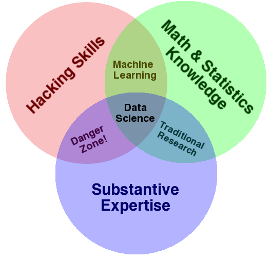
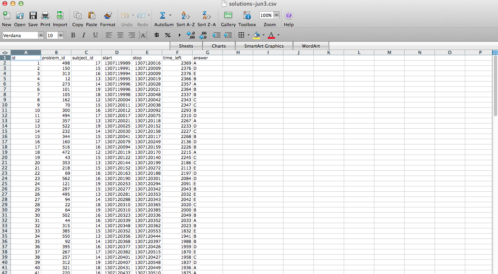
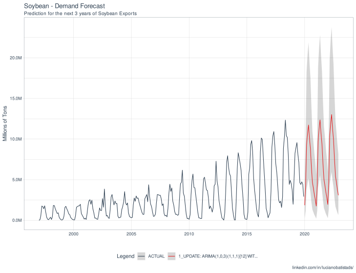
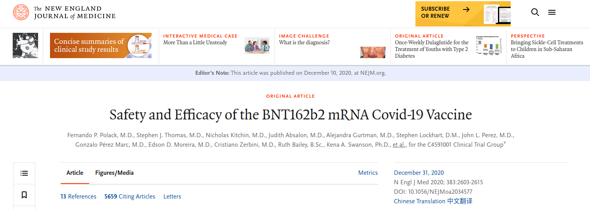

```{r packages_setup, echo=FALSE, message=FALSE, warning=FALSE}
knitr::opts_chunk$set(echo = T, warning = F, message = F)
knitr::opts_chunk$set(fig.width=8, fig.height=6) 
```

class: center, middle, inverse, title-slide

<div class="title-logo"></div>

# Data Analysis and Information Extraction

## Topic 0 - Introduction

<br>
<br>
<br>
<br>
<br>
.pull-left[
### Roi Naveiro
#### Academic Year 2026-2027
]


---

## What is Data Science?

*Data science is an interdisciplinary academic field that uses <font class="vocab">statistics, scientific computing, scientific methods, processing, scientific visualization, algorithms and systems</font> to **extract or extrapolate knowledge and insights** from potentially noisy, structured, or unstructured **data**.*

*Data science also integrates **domain knowledge** from the underlying application domain (e.g., natural sciences, information technology, and medicine). Data science is multifaceted and can be described as a science, a research paradigm, a research method, a discipline, a workflow, and a profession.*

.pull-right[
[-Wikipedia](https://en.wikipedia.org/wiki/Data_science)
]

---

## What is Data Science?




---

## What is Data?

*Data are a collection of discrete or continuous values that convey information, describing the quantity, quality, fact, statistics, other basic units of meaning, or simply sequences of symbols that may be further interpreted formally.* 

.pull-right[
[-Wikipedia](https://en.wikipedia.org/wiki/Data)
]

--

<br>
<font class="vocab">Quite a vague definition!</font>

---

## Types of Data

* Any unit of information is a data point

* An important distinction

  * Structured data
  * Unstructured data
  
---

## Structured Data

Tabular data



---

## Unstructured Data

Everything else

* Images

* Audio

* Video

* Text

---


## Types of Data Analysis

* Descriptive

* Exploratory

* Inferential

* Predictive

* Causal

---

## Descriptive Analysis

**Goal**: to summarize the information contained in a dataset

  * The first type of data analysis to carry out
  * In general, descriptions cannot be **generalized** without the help of statistical models
  
---

## Descriptive Analysis

R's `mtcars` dataset contains information extracted from the *1974 Motor Trend US magazine* about 10 aspects of design and performance for 32 vehicles. The variable `am` refers to the transmission (0 = automatic, 1 = manual)

```{r,fig.align='center',out.extra='angle=90', echo=FALSE}

library(dplyr)
library(explore)
mtcars %>% explore(am)

```

---

## Exploratory Analysis

**Goal**: to discover relationships between features of the data 

  * It motivates research questions

---

## Exploratory Analysis

The variable `wt` refers to the weight of the vehicle and `mpg` to miles per gallon

```{r,fig.align='center',out.extra='angle=90', echo=FALSE}

library(dplyr)
library(explore)
mtcars %>% explore(wt, mpg)

```

---

## Inferential Analysis

**Goal**: to use a small sample of data from a population in order to draw information about that population.

  * This is where **statistics** comes into play
  
---

## Inferential Analysis

```{r, echo=FALSE, out.width = '100%',  fig.align='center'}

```


---
## Predictive Analysis

**Goal**: to use data about a set of objects to predict the value of a variable in an object never seen before

  * X predicting Y does not imply that X causes Y

---
## Predictive Analysis

```{r pressure, echo=FALSE, out.width = '80%',  fig.align='center'}

```

[Source](https://www.r-bloggers.com/2020/11/time-series-demand-forecasting/)

---
## Causal Analysis

**Goal**: to find out what happens to one variable when the value of another is changed

  * Causal relationships usually identify average effects, not individual effects

---
## Causal Analysis


$$\\[1in]$$

```{r, echo=FALSE, out.width = '100%',  fig.align='center'}

```


---
## This course

Getting into data science through R. We will focus exclusively on:

* Tabular data (observations x variables)

* Descriptive, Exploratory and Inferential Analysis

```{r, echo=FALSE, out.width = '100%',  fig.align='center'}
knitr::include_graphics("img/data-science-explore.png")
```

We will learn the fundamental R tools for the different stages of this scheme.

---
## The stages of an information analysis project

1. **Import**: load data into R coming from: a database, a file, a web application (API), etc.

2. **Organization**: store data in a way that is consistent with the analysis.

3. **Transformation**: filtering, creating derived variables, etc.

4. **Visualization**:  generating questions, discovering trends.

5. **Exploratory Analysis**: Visualization + transformation applied systematically.

6. **Modeling**: confirming hypotheses, answering questions.

7. **Communication**: communicating results

---
## The stages of an information analysis project


- 1,2,3 $\rightarrow$ Data Wrangling
- 3,4,5 $\rightarrow$ Data exploration
- 6 $\rightarrow$ Modeling
- 7 $\rightarrow$ Communication


All of this using the **R programming language**.

---

## Program

- Topic 1 - Programming in R

- Topic 2 - Exploratory Data Analysis

- Topic 3 - Data Wrangling

- Topic 4 - Modeling

- Topic 5 - Communication of Results 


---

## R and RStudio


### What is R/RStudio?

- R is a programming language specialized in statistics
- RStudio is an interface for programming in R

```{r, echo=FALSE, out.width = '80%',  fig.align='center'}
knitr::include_graphics("img/r-rstudio.png")
```


[Installing R and RStudio](https://rstudio-education.github.io/hopr/starting.html)


---

## Course Information

* Data Analysis and Information Extraction. 

* Lecturer: Roi Naveiro

* Email: roi.naveiro@cunef.edu

* Course website: [https://cunef-aeinf.github.io/eco-26-27/](https://cunef-aeinf.github.io/eco-26-27/)

---

## Schedule

* *Class schedule*: 

  - Monday 16.00 - 17.00
  - Thursday 16.00 - 18.00

* *Attendance:* Mandatory, at least 80%
---

## Assessment

* **Regular exam session**

  - Continuous assessment: Midterm 1: 20%
  - Continuous assessment: Midterm 2: 20%
  - Final Exam: 60% (all course content)
  
* **Resit exam session**: Resit Final Exam (60%) + continuous assessment. The continuous assessment grade for the resit session will be the better of:

  - The continuous assessment grade
  - The weighted average of the continuous assessment and the regular final exam

---

## Useful Resources

* [Data analysis on the evolution of music trends](https://towardsdatascience.com/billboard-hot-100-analytics-using-data-to-understand-the-shift-in-popular-music-in-the-last-60-ac3919d39b49)

* [A year as told by FitBit](https://livefreeordichotomize.com/2017/12/27/a-year-as-told-by-fitbit/)

* [TED Talk](https://www.youtube.com/watch?v=hVimVzgtD6w)

* [RMarkDown](https://www.rstudio.com/wp-content/uploads/2015/02/rmarkdown-cheatsheet.pdf)
---

## Bibliography

* [Hands-On Programming with R](https://rstudio-education.github.io/hopr/), Grolemund (2014)

* [R for Data Science](https://r4ds.had.co.nz/), Wickham and Grolemund (2016)

* [Data Visualization, A practical introduction](https://socviz.co/), Healy (2018)

* [Data Science Specialization](https://github.com/DataScienceSpecialization/courses), Johns Hopkins University, Coursera

