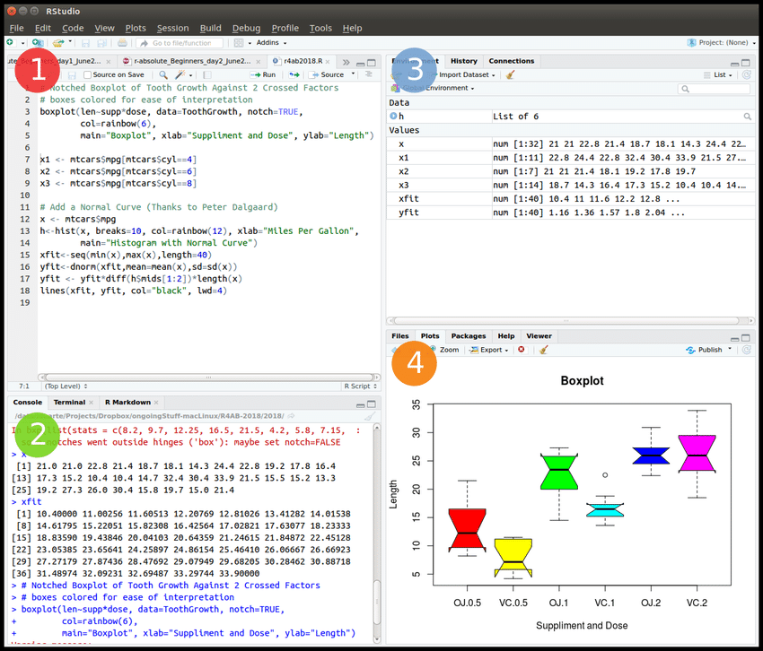
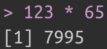
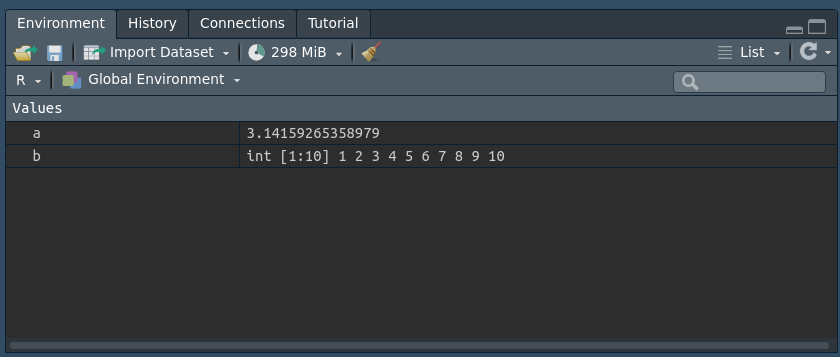

```{r packages_setup, echo=FALSE, message=FALSE, warning=FALSE}
knitr::opts_chunk$set(echo = T, warning = F, message = F)
knitr::opts_chunk$set(fig.width=8, fig.height=6) 
```

class: center, middle, inverse, title-slide

<div class="title-logo"></div>

# Data Analysis and Information Extraction

## Topic 1 - Programming in R

<br>
<br>
<br>
.pull-left[
### Roi Naveiro
#### Academic Year 2026-2027
]


---


## R and RStudio


### What is R/RStudio?

- R is a programming language specialized in statistics
- RStudio is an interface for programming in R

```{r, echo=FALSE, out.width = '80%',  fig.align='center'}

```


[Installing R and RStudio](https://rstudio-education.github.io/hopr/starting.html)

---

## R user interface

- RStudio: the way we communicate with the machine
- R: the language of communication

```{r, echo=FALSE, out.width = '70%',  fig.align='center'}

```
---

class: center, middle, inverse

# Introduction

---
## Running commands

```{r, echo=TRUE}
123 * 65
```

In the console it appears as

```{r, echo=FALSE, out.width = '20%',  fig.align='center'}

```


```{r, echo=FALSE}
options(width = 60)
```

```{r, echo=TRUE}
1000:1020
```

Using it as a calculator

```{r, echo=TRUE}
(7 + 7) / 7 * 2 
```

---


## Comments

* Comments start with `#`

```{r, echo=TRUE}
# This is a comment
# I add up the numbers from 1 to 100
sum(1:100)
```

* Code output is prefixed with `##`

* Check that the following expression holds for $K=100$ and $K=1000$

  $$
  \sum_{i=1}^{K} i = \frac{K \cdot (K + 1)}{2}
  $$
---
## Objects

* If we need a value (or a set of values) repeatedly, we have to **store it in memory**, giving it a name.

```{r, echo=TRUE}
# This creates an R object with the value pi
a <- pi

# I add 3 to the stored value
a + 3
```

* We can store multiple values

```{r, echo=TRUE}
b <- 1:10
b
```

---
## Objects

Stored objects appear in the *Environment* pane

```{r, echo=FALSE, out.width = '100%',  fig.align='center'}

```

An object name cannot start with a number, nor can it include certain special characters such as `^`, `$`, `@`, etc.

---
## Objects

R overwrites

```{r, echo=TRUE}
c <- 5
c

c <- 20
c
```

The `ls()` function shows the names in use

```{r, echo=TRUE}
ls()
```

---
## Operations on objects

* R performs operations *element-wise*

* Vector - Number
```{r, echo=TRUE}
b <- 1:10
b + 7
```

* Vector - Vector (same length)
```{r, echo=TRUE}
b * b
```

---
## Operations on objects

* Vector - Vector (different length)

```{r, echo=TRUE}
# R recycles the short vector until it reaches the length of the long one
# If the short length is not a multiple of the long one, it throws a warning
d <- 1:2
e <- 1:4

d * e
```

Try it out!

---

## The `c()` function

This function helps us combine objects.
For example, we can create a vector of integers as follows

```{r, echo=TRUE}
a <- c(1,2,3)
a
```

We can also add elements to an existing vector
```{r, echo=TRUE}
a <- c(a, 4,5)
a
```

We are not limited to vectors of numbers!

```{r, echo=TRUE}
a <- c('goodbye', 'hello')
a
```
---

class: center, middle, inverse

# Functions

---
## Functions

R has many built-in functions 
```{r, echo=TRUE}
# Computes the mean of the numbers from 1 to 10
mean(1:10)

# The argument of a function can be the result of another function
round(mean(1:10))
```

---
## Functions

Some functions take multiple arguments. Each one has a name

```{r, echo=TRUE}
# Draws one number at random from 1 to 10
sample(x = 1:10, size = 1)

# The name is optional
sample(1:10, 1)
```

If we do not write the argument names, we must supply them in the correct order specified in the function documentation.

---
## Functions

The `args()` function shows the arguments of a function
```{r, echo=TRUE}
args(sample)
```

Some have default values! This means that if we do not specify an argument, R will use the default value.

Question: what default values does the `round()` function have?

**Good practice**: write out the argument names (except perhaps the first one).

---
## Some Functions 

| Function  | Meaning                       | 
|:----------|:------------------------------| 
| `log`      | Natural log                  | 
| `exp`      | Exponential                  | 
| `min`      | Minimum element              | 
| `max`      | Maximum element              | 
| `sum`      | Sum                          | 
| `mean`     | Mean                         | 
| `median`   | Median                       | 
| `var`      | Variance                     | 
| `sd`       | Std. Dev.                    | 
| `quantile` | Percentiles 0,25,50,75,100   | 
| `cor`      | Correlation                  | 

---
## Defining our own functions

* They let us define operations we use repeatedly (and that are not built into R).
```{r, echo=TRUE, eval=FALSE}
a_function <- function(){}
```

* A function that generates 2 numbers between 1 and 100 and returns their sum

--

```{r, echo=TRUE}
gen2_1_100 <- function(){
  nums <- sample(1:100, size = 2, replace = TRUE)
  print(nums)
  return(sum(nums))
}
```

---
## Defining our own functions

* Let us try it out

```{r, echo=TRUE}
a <- gen2_1_100()
a
```

---
## Defining our own functions

* Arguments

```{r, echo=TRUE}
# We pass the size as an argument
# 2 is the default value
gen2_1_100 <- function(n=2){
  nums <- sample(1:100, size = n, replace = TRUE)
  print(nums)
  return(sum(nums))
}
```

* Let us try it without an argument

```{r, echo=TRUE}
gen2_1_100()
```

---
## Defining our own functions

* Let us try it with an argument
```{r, echo=TRUE}
gen2_1_100(10)
```


---

class: center, middle, inverse

# Packages and help

---
## Packages and help

* **Important**: the first step in creating (anything) is to check whether someone has already created it...

* ...the same goes for functions in R.

* Many R functions have been written and bundled into **packages**.

* [Here](https://rstudio-education.github.io/hopr/packages2.html) you can see how to install and update packages in R.

---
## Packages and help

* For example, installing `tidyverse`

```{r, eval=FALSE}
install.packages("tidyverse")
```

* To use packages in R we have to load them

```{r, eval=TRUE}
library("tidyverse")
```

---
## Packages and help

* There are countless functions in R and its packages...

* ...memorising them all is hard (and pointless).

* Functions come with help pages, which are called as follows

```{r, eval=FALSE}
?sample
```

---
## Packages and help

* The best source of help is the internet.

* For example, [Stack Overflow](https://stackoverflow.co/).

* Another useful resource is [community.rstudio.com](https://community.rstudio.com).


---

class: center, middle, inverse

# R objects

---
## R objects

An R object is a data structure that has some methods and attributes associated with it.

We will study the following objects:
1. Atomic vectors
2. Matrices
3. Arrays
4. Dates and times
5. Factors
6. Lists
7. Data frames
---
## 1. Atomic vectors

They are simply vectors of data. We have already seen how to create them.

```{r}
a = c(1,2,3)

# Checks whether it is a vector
is.vector(a)

# Returns the length of the vector
length(a)
```

Each vector stores only one type of data

---
## 1. Atomic vectors
### Data types - Doubles

Double vectors store real numbers

```{r}
a = c(1.7,2,3.5)

# Returns the type of the vector
typeof(a)
```

---
## 1. Atomic vectors
### Data types - Integers

Integer vectors store whole numbers

```{r}
a = c(1L,-2L,3L)

# Returns the type of the vector
typeof(a)
```
---
## 1. Atomic vectors
### Data types - Characters

Character vectors (strings) store text

```{r}
a = c("Hello", "Goodbye")

# Returns the type of the vector
typeof(a)
```

WATCH OUT: what is going on here?
```{r}
a = c(1,2,3,"Hello")
a
```

This phenomenon is called **coercion**. It is important that you read about it at
[https://rstudio-education.github.io/hopr/r-objects.html#coercion](https://rstudio-education.github.io/hopr/r-objects.html#coercion).

---
## 1. Atomic vectors
### Data types - Logicals
Logical vectors store `TRUE` or `FALSE` (Boolean data).

```{r}
a = c(5>4, 4>5)
typeof(a)
a
```

---
## Logical operations

<br>
<br>

| Operator  | Meaning           | 
|:----------|:------------------| 
| `==`      | Equal to          | 
| `!=`      | Not equal to      | 
| `>`       | Greater than      | 
| `>=`      | Greater or equal  | 
| `<`       | Less than         | 
| `<=`      | Less or equal     | 
| `%in%`    | Is in the set     |

---
## Aside: Attributes

These are pieces of information that can be attached to R objects.

```{r}
a = 1:10
attributes(a)
```

Some important attributes: names and dimension.

---
## Attributes - Names
```{r}
a = 1:3
# I assign names to the vector a
names(a) <- c("one", "two", "three")
names(a)

#I check that the attribute has been stored
attributes(a)
```

---
## Attributes - Dimension
```{r}
a = 1:10
# I assign a dimension; this turns a into a matrix

dim(a) = c(2,5)

#I check the dimension
dim(a)
```

---
## 2. Matrices
They are used to store two-dimensional matrices

```{r}
m <- matrix(1:10, nrow=2)
m
m <- matrix(1:10, nrow=2, byrow=TRUE)
m
```

---
## 3. Arrays
They are used to store n-dimensional arrays
```{r}
m <- array(1:12, dim = c(2,2,3))
m
```

---
## Aside: Classes

A class is simply the fingerprint of an R object.
It represents the set of properties or methods common to all objects of a given type.
The `class` function describes the class the object belongs to.

```{r}
m <- array(1:12, dim = c(2,2,3))
class(m)
```

---
## 4. Dates and Times
```{r}
current_time <- Sys.time()
current_time

class(current_time)
```

---
## 5.  Factors

They are used to store categorical variables, with a fixed set of levels (categories).

```{r}
smoker <- factor( c("YES", "NO", "NO", "YES") )
attributes(smoker)
```


```{r}
# We convert the factor to character
smoker <- as.character(smoker)
class(smoker)
```

---
## 6. Lists

We have seen that atomic vectors group individual values (of the same type).
Lists store R objects.
```{r}
mylist <- list(c("A", "B"), 1:10, Sys.time())
mylist
```

---
## 7. Data Frames
The two-dimensional version of a list. Different columns of a data frame can contain different types of data. However, all the data within a given column must be of the same type.
A data frame is created by specifying its columns (which are atomic vectors)

```{r}
df <- data.frame(patient = c("MARIANO", "IRENE", "INES"), smoker = c("YES", "NO", "YES"), age = c(64, 32, 38))
df
```
---
## 7. Data Frames
```{r}
# We check the class
class(df)

# We summarise the information
str(df)
```

We can inspect the data frame from the *Environment* pane

---

class: center, middle, inverse

# Selecting and modifying values


---
## Selecting values

### Indexing by position

| Syntax      | Meaning                       | 
|:------------|:------------------------------| 
| `x[3]`      | Third element                 | 
| `x[-3]`     | All but the third             | 
| `x[2:4]`    | Elements 2,3,4                | 
| `x[-(2:4)]` | All but 2,3,4                 | 
| `x[c(1,5)]` | Elements 1 and 5              | 

---
## Selecting values

### Indexing by value


| Syntax               | Meaning                             | 
|:---------------------|:------------------------------------| 
| `x[x==10]`           | Elements equal to 10                | 
| `x[x<0]`             | Elements smaller than 0             | 
| `x[x %in% c(1,2,5)]` | Elements that are either 1, 2 or 5  | 


---
## Selecting values

### Indexing by name

| Syntax               | Meaning                             | 
|:---------------------|:------------------------------------| 
| `x["patient1"]`      | Elements named patient1             | 


---
## Selecting values 

In a data frame

```{r}
# Selection with integers
df[1,2]

# More than one element
df[1:2, 2:3]
```

---
## Selecting values 

In a data frame

```{r}
# Selection with negative integers
df[-c(1,2),1:3]

# Selection leaving a blank space
df[,-2]

# Selection with logical variables
df[1,c(TRUE, TRUE, FALSE)]
```

---
## Selecting values 

In a data frame

```{r}
# Selection with names
df[c(1,3), "smoker"]

# Selecting columns with $
df$patient
```

---
## Selecting values 
With logical expressions!

```{r}
# Select the smokers
df[df$smoker == "YES", ]

# Select those younger than 33
df[df$age < 33, ]
```

---
## Selecting values 
Logical expressions can be combined with Boolean operators
```{r}
exp1 <- 5>3
exp2 <- "A" != "A"
exp3 <- 3 %in% c(1,2,3)

# AND
exp1 & exp2

# OR
exp1 | exp2

# Negation
!exp1
```
---
## Selecting values 
Logical expressions can be combined with Boolean operators

```{r}
# Any
any(exp1, exp2, exp3)

# All
all(exp1, exp2, exp3)


```

---
## Selecting values 
Logical expressions can be combined with Boolean operators

```{r}
# Select the smokers younger than 60
df[df$smoker == "YES" & df$age < 60,]
```


---
## Selecting values 
In a list

```{r}
mylist <- list(letters = c("A", "B"), numbers = 1:10, time = Sys.time())

mylist[1]

mylist[[1]]

mylist["letters"]

mylist[["letters"]]
```


---
## Modifying values

```{r}
vec <- 1:10

# Modify values with integers
vec[3] <- 300
vec

# Modify values with a selection
vec[c(1,4)] <- c(100, 400)
vec

# Modify values with a selection
vec[c(5:6)] <- vec[c(5:6)] + 100 
vec
```

---
## Modifying values

```{r}
# We add a variable to the data frame
df$hypertensive <- c("YES", "NO", "NO")
df

# We delete the column
df$hypertensive <- NULL

# We modify a specific value
df[1, "age"] <- 57
df
```

---

class: center, middle, inverse

# Loops and conditionals

---

## Conditionals and loops

Conditionals and loops are the two most important programming structures, whatever language we use.

1. Conditionals let us run a piece of code depending on whether a logical condition holds.

2. Loops let us repeat a piece of code a specific number of times.

---
## 1. Conditionals

They tell R to carry out a task if a condition holds

```{r, eval=F}
if (this holds) {
  do this
}
```

`if` takes a logical expression (`TRUE` or `FALSE`).

They can be nested
```{r}
x <- 7
if(x <= 8){
  if(x>=5){
    print("Number in [5,8]")
  }
}
```
Do the above with a single `if`.

---
## 1. Conditionals

`if` is complemented by `else`
```{r, eval=F}
if (this holds) {
  do this
} else{
  otherwise, do this instead
}
```

If there are more than two conditions, we can use `else if`

```{r, eval=F}
if (this holds) {
  do this
} else if(this other thing holds){
  do this other thing
} else{
  otherwise do this
}
```

---
## 1. Conditionals

Example
```{r, eval=F}
x <- 7
if (x>7) {
  print(x + 3)
} else if(x<7){
  print(x-3)
} else{
  print(x)
}
```

---
## 1. Conditionals

The if-else operation can be done in a single line with the `ifelse` function, which has the following structure.

```{r eval=F}
ifelse(condition, value if TRUE, value if FALSE)
```

For example

```{r}
x <- 4
ifelse(x==3, "it is three", "it is not three")
```

---
## 1. Conditionals

The `ifelse` operation, unlike `if`, **is vectorised**.
This means it is applied element by element over vectors. For example

```{r}
x <- sample(1:10, 5, replace=T)
ifelse(x%%2==0, "Even", "Odd")
```

With `if-else` this would throw an error. 

---
## 1. Conditionals

The generalisation of `ifelse` to multiple conditions is `case_when` from the `dplyr` package.

```{r eval=F}
case_when(
  condition1 ~ value1,
  condition2 ~ value2,
  ...
)
```

For example

```{r}
library(dplyr)
x <- c(3,4,5)
case_when(
  x == 3 ~ "it is three",
  x == 4 ~ "it is four",
  TRUE ~ "it is neither three nor four"
)
```

---
## 2. Loops

They let us repeat operations a certain number of times. 
We will study `for` and `while` loops.

---
## 2. Loops - For

It repeats a piece of code many times, once for each element of an input set
```{r, eval=F}
for(value in set){
  do this
}
```

---
## 2. Loops - For

Example

```{r}
for(value in c("A", "B", "C")){
  print("Iterating")
}

for(value in c("A", "B", "C")){
  print(value)
}
```

---
## 2. Loops - While

It runs a piece of code while the input condition holds

```{r, eval=F}
while(condition){
  do this
}
```

Example
```{r}
x <- 1
while(x < 8){
  print(x)
  x <- x + 1
}
```


---

## Bibliography

This topic is largely based on  [Hands-On Programming with R](https://rstudio-education.github.io/hopr/), Grolemund (2014)


