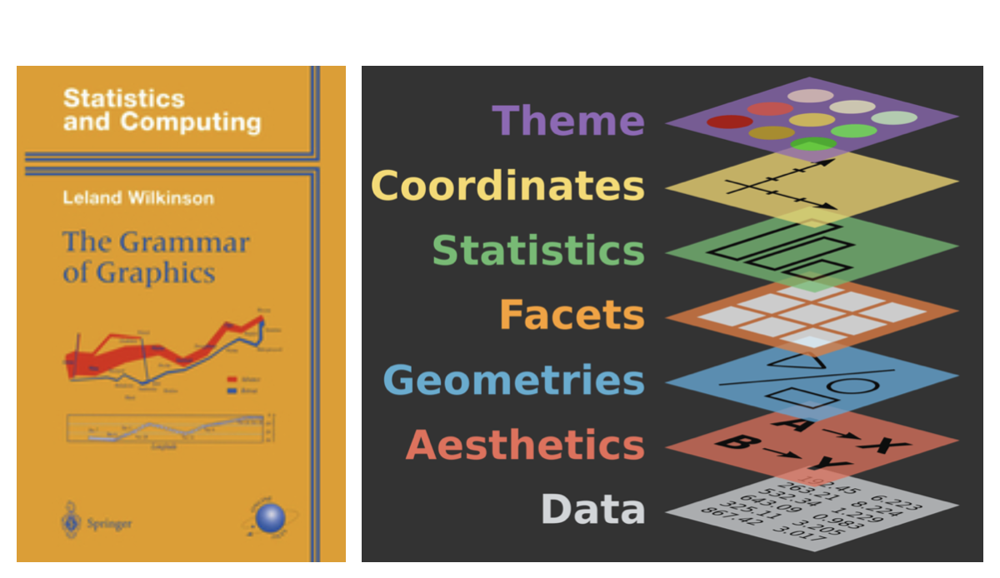
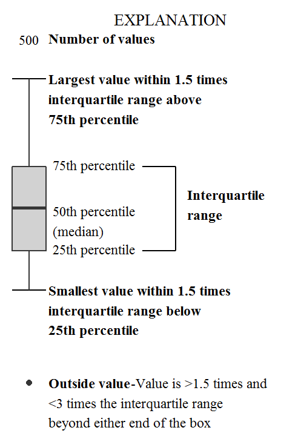

```{r packages_setup, echo=FALSE, message=FALSE, warning=FALSE}
knitr::opts_chunk$set(echo = T, warning = F, message = F)
knitr::opts_chunk$set(fig.width=7, fig.height=5, fig.align='center') 
```

class: center, middle, inverse, title-slide

<div class="title-logo"></div>

<br>
# Data Analysis and Information Extraction

## Topic 2 - Exploratory Data Analysis

### 2.1 Data Visualization 

<br>
.pull-left[
### Roi Naveiro
#### Academic Year 2026-2027
]
---

## Exploratory Data Analysis

* The art of observing the data, generating hypotheses and testing them.

* **Goal**: generate promising questions in order to explore them later in greater depth

```{r pressure, echo=FALSE, out.width = '80%',  fig.align='center'}
knitr::include_graphics("img/data-science-explore.png")
```

---
## tidyverse

We want to analyze the data in a **reproducible** way

.pull-left[

]

.pull-right[
.center[
[tidyverse.org](https://www.tidyverse.org/)
]

- Tidyverse is a collection of R packages for data science
- All the packages share a common philosophy and a common grammar
]


---
class: center, middle, inverse

# The tibble object

---
## The tibble object

* All tidyverse packages work with tibbles

* The tibble object is similar to the data frame we have already seen

* However, it includes some new features that make it especially convenient for data analysis.

* Before we start, we must load the `tidyverse` library

```{r}
library(tidyverse)
```
---
## Creating tibbles

* We can create a tibble from a dataframe

```{r}
as_tibble(iris)
```

---
## Creating tibbles

* We can create a tibble from vectors, in a similar way to how we did with dataframes

```{r}
dt <- tibble(
  p = c("A", "B", "C", "D", "E"),
  x = 1:5,
  y = 2,
  z = x + y
)
dt
```

---
## Creating tibbles

* We can give complex names to the columns of a tibble

```{r}
dt <- tibble(
  `Number of :)` = 1:5,
  ` ` = 2,
  `300` = 300
)
dt
```

---
## Tibbles vs Data Frames

### Printing

Tibbles have a refined `print` method that by default shows only the first 10 rows

```{r}
iris
```

---
## Tibbles vs Data Frames

### Printing

Tibbles have a refined `print` method that by default shows only the first 10 rows

```{r}
dt <- as_tibble(iris)
```

---
## Tibbles vs Data Frames

### Printing

This is done so as not to overload the console with prints. And what if we need more than 10 rows? PIPES!

```{r}
dt %>% print(n=11, width=Inf)
```

---
## Tibbles vs Data Frames

### Printing

In RStudio, this lets us explore the dataframe in a different window.

```{r, eval=F}
dt %>% View()
```

---
## Tibbles vs Data Frames

### Subsetting

To select a single variable use `$` (by name) or `[[` (by name or position)
```{r}
# Extract by name
dt$Species[1:10]

# Extract by position
dt[[5]][1:10]
```


---
## Tibbles vs Data Frames

### Subsetting

Also with the pipe
```{r}
dt %>% .$Species
```

---
## Tibbles vs Data Frames

Convert back to a data frame
```{r}
class( as.data.frame(dt) )
```


---
class: center, middle, inverse

## Data Visualization

---

## Data Visualization

Creating and studying visual representations of the data

* In this part of the course we will focus on learning to use `ggplot2`, a tidyverse package that is really useful for visualization

* EDA includes, in addition to visualization, data manipulation

* EDA combines visualization and manipulation with each person's own curiosity and skepticism in order to ask and answer interesting questions about the data

---

## ggplot2 

- **ggplot2** is the tidyverse visualization package
-  `gg` stands for Grammar of Graphics
- It is inspired by the book **Grammar of Graphics** by Leland Wilkinson

```{r, echo=FALSE, out.width = '60%',  fig.align='center'}

```

GG: a tool that allows us to describe the components of a plot sequentially


---
## Data Visualization

First we load the required libraries

```{r}
library(tidyverse)
library(gapminder)
```

We take a look at the data

```{r, echo=F}
options(width = 60)
```

```{r}
glimpse(gapminder)
```

---

class: center, middle, inverse

# Data Visualization: Visualizing the relationship between GDP per capita and life expectancy

---


## First visualization

What does each line do?
```{r, fig.align='center',out.extra='angle=90'}
gapminder67 <- gapminder %>% filter(year == "1967")  #<< 
ggplot(gapminder67, 
     aes(gdpPercap, lifeExp, size = pop, color = continent)) + 
     geom_point() +
     scale_x_log10()  # convert to log scale

```


---

## First visualization

What does each line do?

```{r, fig.align='center',out.extra='angle=90'}
gapminder67 <- gapminder %>% filter(year == "1967") 
ggplot(gapminder67,  
     aes(gdpPercap, lifeExp, size = pop, color = continent)) +  
     geom_point() +  #<<
     scale_x_log10()  # convert to log scale
```

---

## First visualization

What does each line do?

```{r, fig.align='center',out.extra='angle=90'}
gapminder67 <- gapminder %>% filter(year == "1967") 
ggplot(gapminder67,  #<<
     aes(gdpPercap, lifeExp, size = pop, color = continent)) +  #<<
     geom_point() + 
     scale_x_log10()  

```

---

## How `ggplot2` works

- The structure of `ggplot2` code is as follows

```{r eval = FALSE}
ggplot(data = [dataset], 
       mapping = aes(x = [x-variable], y = [y-variable])) +
   geom_xxx() +
   other options
```

* The `mapping`  defines how the variables are mapped to visual properties of the plot.

Documentation [ggplot2.tidyverse.org](http://ggplot2.tidyverse.org/)

---
## How `ggplot2` works

- Alternatively

```{r eval = FALSE}
ggplot(data = [dataset]) +
   geom_xxx( mapping = aes(x = [x-variable], y = [y-variable]) ) +
   other options
```


---
## Step by Step

We take a look at the data

```{r, echo=F}
options(width = 60)
```

```{r}
glimpse(gapminder)
```

We look at `?gapminder`

---
## Step by Step
```{r}
gapminder67 <- gapminder %>% filter(year == "1967") 
gapminder67
```


---
## Step by Step
```{r, fig.align='center',out.extra='angle=90'}
ggplot(gapminder67, aes(x = gdpPercap, y = lifeExp) ) +  
     geom_point() 
```

How would you describe the relationship between GDP per capita and life expectancy?

---
## Step by Step
```{r, fig.align='center',out.extra='angle=90'}
ggplot(gapminder67, aes(x = gdpPercap, y = lifeExp) ) +  
     geom_point() +
     scale_x_log10()  #<<
```

How would you describe the relationship between GDP per capita and life expectancy?


---
## Additional variables

We may want to represent more than two variables. We can do so through other elements
of the plot (in mapping we use only x and y, we can add more)

* **aesthetics**: 

  * shape
  * color
  * size

* **faceting**: several plots

---
class: center, middle, inverse

# Data Visualization: Aesthetics

---

## Aesthetics

The following visual features of the plot can be used to represent 
an extra variable

* shape
* color
* size


---
## Representing the continent

```{r, fig.align='center',out.extra='angle=90'}
ggplot(gapminder67, mapping = aes(x = gdpPercap, y = lifeExp, color = continent) ) +   #<<
     geom_point() +
     scale_x_log10()
```

---
## Representing the continent

```{r, fig.align='center',out.extra='angle=90'}
ggplot(gapminder67, mapping = aes(x = gdpPercap, y = lifeExp, color = continent,  #<<
                        shape = continent) ) +   #<<
     geom_point() +
     scale_x_log10()
```

---
## Representing the continent and the population

```{r, fig.align='center',out.extra='angle=90'}
ggplot(gapminder67, mapping = aes(x = gdpPercap, y = lifeExp, color = continent,  #<<
                        shape = continent, size = pop) ) +   #<<
     geom_point() +
     scale_x_log10()
```

---
## Representing the continent and the population

```{r, fig.align='center',out.extra='angle=90'}
ggplot(gapminder67, mapping = aes(x = gdpPercap, y = lifeExp, color = continent, 
                        shape = continent, size = pop) ) +  
     geom_point(size=3) +  #<<
     scale_x_log10()
```

---
## Summary

Depending on the nature of the variable

.small[
aesthetics    | discrete                 | continuous
------------- | ------------------------ | ------------
color         | different colors         | gradient
size          | discrete steps           | linear mapping between variable and radius
shape         | different shapes         | does not work

]

<br>

.alert[`aes` to represent variables using features of the plot

`geom_xxx` to define the feature of the plot
]

---
class: center, middle, inverse

# Data Visualization: Faceting

---

## Faceting

Multiple plots as a function of a variable

```{r, fig.width=6.5, fig.height=4.5}
ggplot(data = gapminder67, aes(x = gdpPercap, y = lifeExp)) + 
  geom_point() +
  labs(title = "GDP per Capita vs Life Expectancy",
       subtitle = "By continent",
       x = "GDP per Capita ($)", y =  "Life expectancy (years)") +
  facet_grid(. ~ continent)  #<<
```

---

## Faceting

Multiple plots as a function of a variable

```{r, fig.width=6.5, fig.height=4.5}
ggplot(data = gapminder67, aes(x = gdpPercap, y = lifeExp)) + 
  geom_point() +
  labs(title = "GDP per Capita vs Life Expectancy",
       subtitle = "By continent",
       x = "GDP per Capita ($)", y =  "Life expectancy (years)") +
  facet_grid(continent ~ .)  #<<
```

---

## Faceting

Multiple plots as a function of a variable

```{r, fig.width=6.5, fig.height=4.5}
ggplot(data = gapminder67, aes(x = gdpPercap, y = lifeExp)) + 
  geom_point() +
  labs(title = "GDP per Capita vs Life Expectancy",
       subtitle = "By continent",
       x = "GDP per Capita ($)", y =  "Life expectancy (years)") +
  facet_wrap(continent ~ .)  #<<
```

---

## Faceting

Multiple plots as a function of a variable

```{r, fig.width=6.5, fig.height=4.5}
ggplot(data = gapminder67, aes(x = gdpPercap, y = lifeExp)) + 
  geom_point() +
  labs(title = "GDP per Capita vs Life Expectancy",
       subtitle = "By continent",
       x = "GDP per Capita ($)", y =  "Life expectancy (years)") +
  facet_wrap(continent ~ ., scales = "free_x")  #<<
```

---
# Faceting - Summary


- `facet_grid()`: 
    - 2d grid
    - `rows ~ columns`
    - `.` to leave one of them out

--

- `facet_wrap()`: 1d 
    - set the scales with `scales = ` ("free_x", "free_y", "free")

---

## Exercise 1


Using the data from the `gapminder` library:

* Filter the observations corresponding to the years 1957, 1967, 1977, 1987, 1997, 2007

* Plot the relationship between GDP per capita and life expectancy by continent and by year
in different plots using **faceting**. The size of the points must be proportional to the population.
The color must reflect the continent. 

* What conclusions do you draw?


---
class: middle, center

# Data Visualization: different types of data

---

## Number of variables to visualize

- .vocab[Univariate data analysis]: distribution of one variable

<br> 

- .vocab[Bivariate data analysis]: relationship between two variables

<br> 

- .vocab[Multivariate data analysis]: relationship between several variables, generally focusing on two of them and conditioning on the rest


---

## Types of variables

- .vocab[Numerical variables] can be .vocab[continuous] or .vocab[discrete] 
    - *height* is ?
    - *number of cigarettes per day* is ?
    - *distance* is ?

--

- .vocab[Categorical variables], in turn, include .vocab[ordinal] ones if a natural order exists
between their levels, or .vocab[non-ordinal] ones
    - *eye color*  is ?
    - *t-shirt size* is ?

Depending on the type of variable we will use a different type of representation

---
class: center, middle

# Data Visualization: univariate numerical data

---

## How can we describe univariate numerical data?

- .vocab[Shape:]
    - skewness: symmetric, right-skewed, left-skewed
    - number of modes: unimodal, bimodal, multimodal, uniform
    
- .vocab[Centrality:] mean, median, mode

- .vocab[Spread:] range, standard deviation, inter-quartile range

- .vocab[Outliers:] there are unusual observations 

---

## Why visualize them?

```{r}
library(Tmisc)
```

.pull-left[
```{r quartet-view1, echo=FALSE}
head( quartet[1:22,], 15 )
```
]
.pull-right[
```{r quartet-view2, echo=FALSE}
head( quartet[23:44,], 15 )
```
]

---

## Summarizing Anscombe's quartet

```{r quartet-summary}
quartet %>%
  group_by(set) %>%
  summarise(
    mean_x = mean(x), mean_y = mean(y),
    sd_x = sd(x), sd_y = sd(y),
    r = cor(x, y)
  )
```

---

## Visualizing Anscombe's quartet

```{r quartet-plot, out.width = "75%", fig.align = "center"}
ggplot(quartet, aes(x = x, y = y)) +
  geom_point() +
  facet_wrap(~ set, ncol = 4)
```

---

## Visualizing univariate numerical data
Histogram - What does this plot reveal? (Place your bets...)

```{r}
ggplot(gapminder67, mapping = aes(x = gdpPercap)) + 
     geom_histogram(binwidth = 1000) #<<
```

---

## Visualizing univariate numerical data
Histogram - What does this plot reveal? (Place your bets...)

```{r}
ggplot(gapminder67, mapping = aes(x = gdpPercap)) + 
     geom_histogram(bins = 100) #<<
```

---

## Visualizing univariate numerical data
Sometimes useful

```{r}
ggplot(gapminder67, mapping = aes(x = gdpPercap)) + 
     geom_density() #<<
```


---
class: center, middle

## Data Visualization: univariate categorical data

---
## Visualizing univariate categorical data

Bar plot 
```{r}
ggplot(gapminder67, mapping = aes(x = continent)) + 
  geom_bar() #<<
```

---
class: center, middle

## Data Visualization: bivariate data

---

## Data Visualization: continuous - categorical bivariate data

```{r}
ggplot(gapminder67, mapping = aes(x = continent, y = gdpPercap)) + 
  geom_boxplot() #<<
```

---
## Data Visualization: continuous - categorical bivariate data
```{r, echo=FALSE, out.width = '50%',  fig.align='center'}

```

---
## Data Visualization: continuous - continuous bivariate data

Sometimes it is nice to add a fit
```{r, fig.align='center',out.extra='angle=90', fig.width=6, fig.height=4}
ggplot(gapminder67, aes(x = gdpPercap, y = lifeExp) ) +  
     geom_point() +
     scale_x_log10() +
     geom_smooth() #<<
```

---
## Data Visualization: categorical - categorical bivariate data

Dataset `diamonds`

```{r out.width = "70%", fig.align='center'}
ggplot(data = diamonds, mapping = aes(x = clarity, fill = cut)) + 
  geom_bar()  #<<
```

---
## Data Visualization: categorical - categorical bivariate data

Dataset `diamonds`

```{r out.width = "70%", fig.align='center', fig.width=6, fig.height=4}
ggplot(data = diamonds, mapping = aes(x = clarity, fill = cut)) + 
  geom_bar(position = "fill") + #<<
  labs(y = "proportion") 
```

---
class: center, middle

## Data Visualization: statistical transformations

---

## Statistical transformations

Plots such as histograms, bar plots or boxplots apply transformations to the data before displaying them

* Bar plots and histograms: bin the data and display one number for each bin

* Smoothers: fit a model and display the predictions it generates

* Boxplots: compute a summary of the distribution and draw it in a given format

The argument used to specify the summary statistic is  `stat`. You can see its default value in, e.g. `?geom_bar`

---

## Statistical transformations

```{r out.width = "70%", fig.align='center'}
ggplot(data = diamonds) + 
  geom_bar(mapping = aes(x = cut))  #<<
```

---

## Statistical transformations

```{r out.width = "70%", fig.align='center'}
ggplot(data = diamonds) + 
  geom_bar(mapping = aes(x = cut, y = stat(prop), group = 1) )  #<<
```


---

## Statistical transformations

We can create our own statistics

```{r out.width = "70%", fig.align='center', fig.width=5, fig.height=3}
ggplot(data = diamonds) + 
  stat_summary( #<<
    mapping = aes(x = cut, y = depth), #<<
    fun.min = min, #<<
    fun.max = max, #<<
    fun = median #<<
  )
```


---
class: center, middle

## Data Visualization: position adjustment

---
## Position adjustments

```{r out.width = "70%", fig.align='center'}
ggplot(data = diamonds) + 
  geom_bar(mapping = aes(x = cut, fill = clarity) )
  
```

Stacking is done automatically with the position adjustment specified through the variable
`position`

---
## Position adjustments - "identity"

```{r out.width = "70%", fig.align='center'}
ggplot(data = diamonds, mapping = aes(x = cut, fill = clarity)) + 
  geom_bar(alpha = 1/5, position = "identity") #<<
  
```

---
## Position adjustments - "fill"

What is this type of plot good for?

```{r out.width = "70%", fig.align='center'}
ggplot(data = diamonds, mapping = aes(x = cut, fill = clarity)) + 
  geom_bar(position = "fill") #<<
```

---
## Position adjustments - "dodge"

And this one?

```{r out.width = "70%", fig.align='center'}
ggplot(data = diamonds, mapping = aes(x = cut, fill = clarity)) + 
  geom_bar(position = "dodge") #<<
```

---
class: center, middle

## Data Visualization: coordinates

---

##  Coordinates

Functions to modify the coordinates: `coord_xxx()`

.pull-left[
```{r, out.width = "90%", fig.align='center'}
ggplot(data = mpg, mapping = aes(x = class, y = hwy)) + 
  geom_boxplot()
```
]
.pull-right[
```{r, out.width = "90%", fig.align='center'}
ggplot(data = mpg, mapping = aes(x = class, y = hwy)) + 
  geom_boxplot() +
  coord_flip() #<<
```
]

---

##  Coordinates

`coord_quickmap()` computes the correct aspect ratio for maps

.pull-left[
```{r, out.width = "90%", fig.align='center'}
library(maps)
nz <- map_data("nz")

ggplot(nz, aes(long, lat, group = group)) +
  geom_polygon(fill = "white", colour = "black")
```
]
.pull-right[
```{r, out.width = "90%", fig.align='center'}
ggplot(nz, aes(long, lat, group = group)) +
  geom_polygon(fill = "white", colour = "black") +
  coord_quickmap() #<<
```
]

---

##  Coordinates

`coord_polar()`

.pull-left[
```{r, out.width = "70%", fig.align='center'}
bar <- ggplot(data = diamonds) + 
  geom_bar(
    mapping = aes(x = cut, fill = cut), 
    show.legend = FALSE,
    width = 1
  ) + 
  theme(aspect.ratio = 1) +
  labs(x = NULL, y = NULL)

bar + coord_flip() #<<
```
]
.pull-right[
```{r, out.width = "70%", fig.align='center'}
bar + coord_polar()  #<<
```
]
---
## Summary

```{r, eval=FALSE}
ggplot(data = <DATA>) + 
  <GEOM_FUNCTION>(
     mapping = aes(<MAPPINGS>),
     stat = <STAT>, 
     position = <POSITION>
  ) +
  <COORDINATE_FUNCTION> +
  <FACET_FUNCTION>
```

---
class: center, middle

## Data Visualization: tips

---
## Tips

[https://blog.csgsolutions.com/6-tips-for-creating-effective-data-visualizations](https://blog.csgsolutions.com/6-tips-for-creating-effective-data-visualizations)
---


## Bibliography

* [R for Data Science](https://r4ds.had.co.nz/), Wickham and Grolemund (2016)

* [ggplot2.tidyverse.org](http://ggplot2.tidyverse.org/)

* [Data Visualization, A practical introduction](https://socviz.co/), Healy (2018)

* [ggplot2.tidyverse.org](https://ggplot2.tidyverse.org/)

* `ggplot2` [cheat sheet](https://diegokoz.github.io/intro_ds/fuentes/ggplot2-cheatsheet-2.1-Spanish.pdf)

* [Top 50 `ggplot2` visualizations](http://r-statistics.co/Top50-Ggplot2-Visualizations-MasterList-R-Code.html)

* [How the BBC uses `ggplot2`](https://medium.com/bbc-visual-and-data-journalism/how-the-bbc-visual-and-data-journalism-team-works-with-graphics-in-r-ed0b35693535)

* [ggplot2: Elegant Graphics for Data Analysis](https://ggplot2-book.org/)