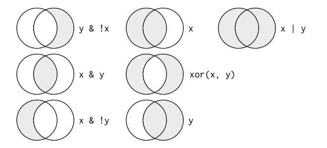

```{r packages_setup, echo=FALSE, message=FALSE, warning=FALSE}
knitr::opts_chunk$set(echo = T, warning = F, message = F)
knitr::opts_chunk$set(fig.width=7, fig.height=5, fig.align='center') 
```

class: center, middle, inverse, title-slide

<div class="title-logo"></div>

<br>

# Data Analysis and Information Extraction

## Topic 2 - Exploratory Data Analysis

### 2.2 Data Transformation 

<br>
.pull-left[
### Roi Naveiro
#### Academic Year 2026-2027
]
---

## Exploratory Data Analysis

* The art of looking at the data, generating hypotheses and testing them.

* **Goal**: generate promising questions in order to explore them later in greater depth

```{r pressure, echo=FALSE, out.width = '80%',  fig.align='center'}
knitr::include_graphics("img/data-science-explore.png")
```


---
class: center, middle, inverse

## Data transformation

---

## Data transformation

Visualization is key to a good understanding of the data...

... however, we rarely find the data in the format we need.

In general, **we need** to

- Create new variables

- Summarize variables

- Rename

- Reorder observations

- Group

- ...

---

## Grammar of data transformation

We will learn how to do this in a **reproducible** way with the `dplyr` package 


```{r dplyr-part-of-tidyverse, echo=FALSE, out.width="30%", fig.align = "center", caption = "dplyr is part of the tidyverse"}
knitr::include_graphics("img/dplyr-part-of-tidyverse.png")
```

Similar to `ggplot2`, `dplyr` introduces a grammar for data transformation
---

## Grammar of data transformation

Some of the functions (verbs) we will learn

.small[
- `select`: select columns by name
- `rename`: rename variables
- `arrange`: sort rows according to a criterion
- `slice`: choose rows by index
- `filter`: choose rows that satisfy a certain condition
- `distinct`: filter for unique rows
- `mutate`: add new variables
- `summarise`: summarize variables using certain statistics
- `group_by`: to carry out operations by group
- ... 
]

---

## Rules of `dplyr`

All the verbs work in a similar way:

- The first argument is the data frame

- The remaining arguments specify what to do with the data frame, using the variable names (without quotes)

- The output is another data frame

The verbs can be **chained**


---

## Data

To learn the different transformations we can apply to the data, we will again use
**gapminder** (more information in `?gapminder`)


```{r, echo=F}
options(width = 60)
```


```{r}
library(tidyverse)
library(gapminder)
glimpse(gapminder)
```

---
class: center, middle, inverse

## Data transformation: `select`
---

## The `select` verb

* We often have datasets with thousands of variables

* We may be interested in only a subset of them

* For this we use `select`
---

## Selecting one column

Look only at the variable for life expectancy (`lifeExp`)


.pull-left[
```{r}
gapminder %>%
  select(lifeExp) #<<
```
]
--
.pull-right[ 
- We pass the data frame through the pipe (`%>%`) to the `select()` function
- The argument is the variable name (without quotes): `lifeExp`
- This gives a dataframe with 1704 rows and 1 column
]

---
## Selecting several columns

.pull-left[
```{r}
gapminder %>%
  select(lifeExp, country) #<<
```
]
--
.pull-right[ 
```{r}
gapminder %>%
  select(lifeExp:gdpPercap) #<<
```
]

**NOTE**: the verbs do not modify the data frame. To save the output as a new dataframe
```{r, eval=F}
life_expectancy <- gapminder %>%
  select(lifeExp) 
```

---
## Inverse selection

.pull-left[
```{r}
gapminder %>%
  select(-lifeExp, -pop, -year ) #<<
```
]
--
.pull-right[ 
```{r}
gapminder %>%
  select(-(continent:gdpPercap) ) #<<
```
]

---
## Other ways of selecting

The following functions are useful

- `starts_with("abc")`: names that start with "abc"

- `ends_with("abc")`: names that end with "abc"

- `contains("abc")`: names that contain "abc"

- `matches("(.)\\1"`) : selects according to regular expressions

- `num_range("x", 1:3)`: selects x1, x2 and x3

---
## Example


```{r}
gapminder %>%
  select( starts_with("co")) #<<
```


---
## Selecting all of them

 `everything()` is useful for placing certain variables at the start of the data frame

```{r}
gapminder %>%
  select( year, everything() ) #<<
```

---
class: center, middle, inverse

## Data transformation: `rename`

---
## Renaming

To rename variables, use `rename`

```{r}
gapminder %>%
  rename( nation = country ) #<<
```

---
class: center, middle, inverse

## Data transformation: `arrange`

---
## Sorting data

Let us select country, year and life expectancy and sort in **increasing** order of life expectancy

```{r}
gapminder %>%
  select( country, year, lifeExp ) %>% #<<
  arrange(lifeExp) #<<
```
---
## Sorting data

Let us select country, year and life expectancy and sort in **decreasing** order of life expectancy

```{r}
gapminder %>%
  select( country, year, lifeExp ) %>% #<<
  arrange(desc(lifeExp)) #<<
```

---
## Sorting data

What is going on?

```{r}
gapminder %>%
  select( country, year, lifeExp ) %>% #<<
  arrange(desc(country)) #<<
```

---
## Sorting data

* By default, `arrange` sorts in ascending order (if the values are numbers)

* For strings, `arrange` sorts alphabetically by default

* `desc()` reverses the order 

* If more than one variable is passed, the sorting is done according to the first one. The remaining ones are used, sequentially, to break ties

* Missing values go to the end

---
class: center, middle, inverse

## Data transformation: pipes
---

## Pipes

* A pipe is a technique for passing information from one process to another

* The pipe structure is implemented in the `magrittr` package (which is loaded with `tidyverse`)

1. We start with the whole dataset

```{r, eval=F}
gapminder %>% #<<
  select( country, year, lifeExp ) %>% 
  arrange(desc(country))  
```
---

## Pipes

* A pipe is a technique for passing information from one process to another

* The pipe structure is implemented in the `magrittr` package (which is loaded with `tidyverse`)

2. This goes into `select`, which selects country, year, lifeExp

```{r, eval=F}
gapminder %>% 
  select( country, year, lifeExp ) %>% #<<
  arrange(desc(country)) 
```

---

## Pipes

* A pipe is a technique for passing information from one process to another

* The pipe structure is implemented in the `magrittr` package (which is loaded with `tidyverse`)

3. Finally, the result of the select goes into `arrange`

```{r, eval=F}
gapminder %>% 
  select( country, year, lifeExp ) %>% 
  arrange(desc(country)) #<<
```

---

## Pipes

Passing the result to `ggplot2`
```{r}
gapminder %>%
  filter(year == 2007) %>%
  ggplot(., aes(x = lifeExp, fill = continent)) + #<<
  geom_density(alpha=0.5) + theme_minimal()
```

---
class: center, middle, inverse

## Data transformation: `slice`
---

## Selecting rows

```{r}
gapminder %>%
  select(country) %>%
  slice(1:3) #<<
```

---

## Selecting rows

How would you select the last three rows of `gapminder` using `slice`?

--

```{r}
gapminder %>%
  slice( (n() - 2) : n()) #<<
```

---

## Selecting rows

Also useful: `head()` and `tail()`

```{r}
gapminder %>%
  select(country) %>%
  head(3) #<<
```

```{r}
gapminder %>%
  select(country) %>%
  tail(3) #<<
```


---
class: center, middle, inverse

## Data transformation: `filter`
---

## Filtering

* Select rows according to their values

* The arguments express the filtering conditions

```{r}
gapminder %>%
  filter(country == "Spain", lifeExp > 80) #<<
```

---
## Filtering

To build complex filters, you need to master the logical operators 

<br>


Operator    | Definition                   || Operator     | Definition
------------|------------------------------||--------------|----------------
`<`         | Less than                    ||`x`&nbsp;&#124;&nbsp;`y`     | `x` OR `y` 
`<=`        |	Less than or equal to        ||`is.na(x)`    | is `x` `NA`?
`>`         | Greater than                 ||`!is.na(x)`   | is `x` not `NA`?
`>=`        |	Greater than or equal to     ||`x %in% y`    | `x` belongs to `y`
`==`        |	Equal to                     ||`!(x %in% y)` |`x` does not belong to `y`
`!=`        |	Different from               ||`!x`          | negation of `x`
`x & y`     | `x` AND `y`                  ||              |

---
## Filtering

What is happening here?

```{r}
sqrt(2)^2 == 2
```

--
```{r}
near(sqrt(2)^2, 2)
```

---
## Filtering

<br>
<br>

```{r echo=FALSE, out.width = '80%',  fig.align='center'}

```

---
## Filtering

By default, the multiple arguments of `filter` are combined with the `AND` operator

Example: select countries in the Americas that in 2007 had a life expectancy above 77 or a GDP per capita below 4000

```{r}
gapminder %>%
    filter(year == 2007, continent == "Americas", (lifeExp > 77 | gdpPercap < 4000) ) #<<
```

---
class: center, middle, inverse

## Data transformation: missing values

---

## Missing values

* Very common in data science

* Almost every operation involving NA returns NA

```{r}
NA == 2

NA + 3

NA == NA
```
---

## Missing values

* When filtering, only the rows for which the condition is `TRUE` are included (so the `FALSE` and the `NA` ones are excluded).

* It is easy to keep them

```{r}
df <- tibble(x = c(1, NA, 3))
filter(df, x > 1)

filter(df, is.na(x) | x > 1)
```

---

## Missing values

We can remove the rows that contain missing values in a given variable with `!is.na()`

```{r}
df <- tibble(x = c(1, NA, 3), y = c(NA, 2, 3))
df %>% filter(!is.na(y))
```
---

## Missing values

To remove all the rows with missing values, use `drop_na()`

```{r}
df <- tibble(x = c(1, NA, 3), y = c(NA, 2, 3))
df %>% drop_na()
```

---
class: center, middle, inverse

## Data transformation: `distinct`

---

## Distinct values
Filter for unique rows

```{r}
gapminder %>% 
  distinct(continent, year) %>% #<<
  arrange(continent, desc(year) )
```

---
class: center, middle, inverse

## Data transformation: `count`

---
## Creating frequency tables

.pull-left[
```{r}
gapminder %>% 
  filter(year == 1967) %>% 
  count(continent) #<<
```
]

.pull-right[
```{r}
gapminder %>% 
  filter(year == 1967) %>% 
  count(continent, sort=TRUE) #<<
```
]

---

## Counting and sorting

```{r}
gapminder %>% 
  filter(year == 1967) %>% 
  count(continent) %>% 
  arrange(n) #<<
```
---

## Counting more than one variable

```{r}
gapminder %>% 
  count(continent, year) #<<
```

---
class: center, middle, inverse

## Data transformation: `mutate`

---

## Adding new columns

```{r}
gapminder %>%
  mutate(gdp = gdpPercap * pop) %>%
  filter(year == 2007) %>%
  arrange( desc(gdp) )
```

* **NOTE 1**: more than one variable can be defined

* **NOTE 2**: in the definition, a newly defined variable can be used

---

## Adding new columns

Many useful functions for adding columns

* Arithmetic operators

* Modular arithmetic: integer division `%/%`, remainder `%%` 

* Logarithms

* Cumulative aggregations `cumsum()`, `cumprod()`, `cummin()`, `cummax()`

* Logical comparisons

* Rankings: `min_rank()`

---

## Examples

```{r}
x = c(1,3,2,7,6)
min_rank(x)

33 %% 10

cumsum(x)
```


---
class: center, middle, inverse

## Data transformation: `summarise`

---
## Creating summary statistics

```{r}
gapminder %>%
  filter(year == 1967) %>%
  summarise(mean_gdpPerCapita = mean(gdpPercap))
```

`summarise()` collapses all the rows into a single summary statistic and drops the columns that are not needed for the computation

---

## The most useful summaries

* Location: `mean()` and `median()`

* Spread: `sd()`, `IQR()`

* Range: `min()`, `quantile(x, 0.25)`, `max()`

* Count: `n()`, `n_distinct()`


---
class: center, middle, inverse

## Data transformation: `group_by`

---

## Grouping

`summarise()` is extremely useful when it is used together with `group_by()`.
This makes it possible to obtain summary statistics for different groups

```{r}
gapminder %>%
  filter(year == 1967) %>%
  group_by(continent) %>%
  summarise(mean_gdpPerCapita = mean(gdpPercap))
```

---

## Grouping

```{r}
gapminder %>%
  filter(year == 1967) %>%
  group_by(continent) %>%
  summarise(n = n(),
            mean_gdpPerCapita = mean(gdpPercap),
            median_gdpPercapita = median(gdpPercap),
            )
```

**NOTE**: if there are missing values, add `na.rm = TRUE`, e.g. `mean(x, na.rm = TRUE)`

---

## Grouping by several variables

Note that when a summarise is applied, the grouping by the last variable given in group_by is undone

```{r}
gapminder %>%
  group_by(continent, year) %>%
  summarise(
            max_gdpPercapita    = max(gdpPercap),
            min_gdpPercapita    = min(gdpPercap)
            ) %>% 
  filter(year %in% c(1967, 2007))
```

.
---

## Grouping

To ungroup completely we can use `ungroup()`

```{r}
# We group by one column
gapminder_g <- gapminder %>% 
  group_by(continent)


gapminder_g %>% slice(1)
```

---

## Grouping

To ungroup completely we can use `ungroup()`

```{r}
# We ungroup the dataframe
gapminder_ng <- gapminder %>% 
  ungroup()

gapminder_ng %>% slice(1)
```

---

## Grouping

Careful:

```{r}
# We group by one column
gapminder_g <- gapminder %>% 
  group_by(continent)


gapminder_g %>% head(1)
```

---

## Grouping

What is the difference between these two ways of counting?

```{r}
library(palmerpenguins)

penguins %>%
  group_by(species, island) %>%
  summarise(count = n())

```


---

## Grouping

What is the difference between these two ways of counting?

```{r}
penguins %>% 
  count(species, island)
```
---

## Grouping

What is going on?

```{r}
penguins %>%
  group_by(species, island) %>%
  summarise(count = n()) %>%
  mutate(prop = count / sum(count)) 
```

---

## Grouping

What is going on?

```{r}
penguins %>% 
  count(species, island) %>%
  mutate(prop = n / sum(n))
```


---


## Challenge

For each continent, compute the proportion of countries that in 1967 had a life expectancy between  0-10, 10-20, 20-30, etc.  relative to the total number of countries in the continent.


```{r eval=FALSE, echo=FALSE}
gapminder %>% filter(year == 1967) %>%
  mutate(lifeExpDecade = lifeExp - lifeExp%%10) %>%
  count(continent, lifeExpDecade) %>%
  group_by(continent) %>%
  mutate(prop = n / sum(n)) 
```


---

## Bibliography

* [R for Data Science](https://r4ds.had.co.nz/), Wickham and Grolemund (2016)
