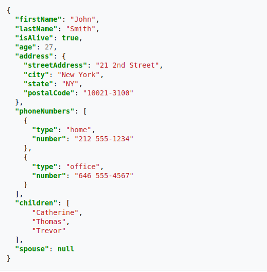

```{r packages_setup, echo=FALSE, message=FALSE, warning=FALSE}
knitr::opts_chunk$set(echo = T, warning = F, message = F)
knitr::opts_chunk$set(fig.width=8, fig.height=6) 
```

class: center, middle, inverse, title-slide

<div class="title-logo"></div>

# Data Analysis and Information Extraction
 
## Topic 3 - Data Wrangling

### 3.1 Data Importation
<br>
<br>
.pull-left[
### Roi Naveiro
#### Academic Year 2026-2027
]
---


## Data Wrangling

**Goal**: get the data ready for its subsequent **exploration** and **modeling**

Turn **raw data** into **processed data**

**Raw data**

  - The data exactly as it appears in the original source
  
  - It has not undergone any manipulation
  
**Processed data**

  - Each variable is a column
  
  - Each observation a row
  
  - Each observational unit is a cell
  
  - More complex data, in several interconnected tables
  
---
## Data Wrangling

* Data importation
* Data organization
* Data transformation

```{r, echo=FALSE, out.width = '100%',  fig.align='center'}
knitr::include_graphics("img/data-science-wrangle.png")
```


---
class: center, middle, inverse

# Data importation

---
## Data importation

* We will learn how to download and read data in R

* We will focus on **tabular data**

* Again, for this part, we will need to load `tidyverse`

```{r}
library(tidyverse)
```

We will follow this outline

* Downloading data
* Reading files in R-base
* Reading files with tidyverse

---
class: center, middle, inverse

# Data importation: Downloading data

---

## Working directory

* It is important to know the working directory (the place on your computer where R is running)

* Two essential commands: `getwd()` and `setwd()`

```{r, eval=FALSE}
# Returns the working directory
getwd()
```

```{r, eval=FALSE}
# Changes the working directory
setwd()
```

---

## Working directory

To navigate inside your computer, you need to know how to build paths.
There are two ways of specifying paths to the computer:

* Absolute paths

```{r eval=F}
# Linux / MacOS
setwd("/home/roi.naveiro/data") 

# Windows 
setwd("C:/Users/roi.naveiro/data") 
```


* Relative paths

```{r eval=FALSE}
# Path relative to the root directory
setwd("./data")

# Directory relative to the directory above the root
setwd("../data")
```

---

## Downloading data

We are going to see how to create a `data` folder from R (if it does not exist) and download some data into it

1. Check whether a folder called `data` exists in the current directory. If not, create it. Use the functions `file.exists()` and `dir.create()`. Try it


---

## Downloading data

We are going to see how to create a `data` folder from R (if it does not exist) and download some data into it

1. Download the data on red wine quality indicators [https://archive.ics.uci.edu/ml/datasets/Wine+Quality](https://archive.ics.uci.edu/ml/datasets/Wine+Quality).

```{r, eval=FALSE}
data_url <- "https://archive.ics.uci.edu/ml/machine-learning-databases/wine-quality/winequality-red.csv"
download.file(data_url, destfile = "data/red_qualities.csv")
list.files("./data")
```

---
class: center, middle, inverse

# Data importation: Reading files in R-base
---

## `read.table()`

```{r}
# This is how we read data with read.table
# NOTE: the separator is ;
red_wine_data <- read.table("data/red_qualities.csv", header = T, sep = ';')
red_wine_data %>% head(5)
```

---

##  `read.table()`

Some important parameters

* _na.strings_ - choose the character that represents a missing value
* _nrows_ - how many rows to read (e.g. nrows=10 reads 10 rows)
* _skip_ - number of rows to ignore before starting to read


---

##  `read.csv()`

* Specific version of `read.table` for reading *comma-separated values* (CSV) files

* By default, it assumes that there is a header and that the separator is the comma

```{r}
# This is how we read data with read.csv
red_wine_data <- read.csv("data/red_qualities.csv", sep=";")
red_wine_data %>% head(5)
``` 


---
class: center, middle, inverse

# Data importation: Reading files with tidyverse packages

---
## The `readr` package

Now we will see how to read data with the `readr` package, which is part of `tidyverse`

```{r}
library(tidyverse)
```

The `readr` functions take care of transforming flat files into *tibbles*


---

.pull-left[
## readr

- `read_csv()` - files delimited by `,`
- `read_csv2()` - files delimited by `;` that use the comma as the decimal separator
- `read_tsv()` - tab-delimited files
- `read_delim()` - files with any delimiter
- ...
]

--
.pull-right[
## readxl

- `read_excel()` - xls or xlsx files 
- ...
]

---
## Reading data

```{r}
red_wine_data <- read_csv2("data/red_qualities.csv")
red_wine_data
```
---
## Reading data

We can also pass it a hand-written csv
```{r}
df <- read_csv("a,b,c
               1,2,3
               4,5,6")
df
```

```{r}
df <- read_csv2("a;b,;c
               1,5;2,2;3
               4;5;6,2")
df
```

---
## Reading data

This is how we prevent a line from being read
```{r}
df <- read_csv("Metadata line
               a,b,c
               1,2,3
               4,5,6", skip=1)
df
```

---
## Reading data

This is how we prevent comments from being read

```{r}
df <- read_csv("# Metadata line
               a,b,c
               # A comment
               1,2,3
               4,5,6", comment = '#')
df
```

---
## Reading data

If the columns have no names
```{r}
df <- read_csv("a,b,c
               1,2,3
               4,5,6", col_names=FALSE)
df
```

---
## Reading data

If we want to name the columns

```{r}
df <- read_csv("a,b,c
               1,2,3
               4,5,6", col_names=c("p", "q", "r"))
df
```

---
## Reading data

Giving names in an appropriate format

```{r}
df <- read_csv("First Name, Is Smoker, PATIENT_AGE
               John, YES, 35
               Mary, NO, 64")
df %>% janitor::clean_names()
```

---
## Reading data

We can indicate which characters refer to a missing value

```{r}
df <- read_csv("a,b,c
               1,nan,3
               4,5,nan", na = "nan")
df
```

---
# Reading data in excel

We need the `library(readxl)` package.

```{r}
library(readxl)
df <- read_excel("data/red_qualities.xlsx", sheet = 1)

df %>% head(5)
```


---
class: center, middle, inverse

# Data importation: Parsing vectors and files

---
## Parsing vectors

The `read_csv` function internally **parses** a text file. That is, it converts a text
file into an organized data structure.

To better understand how it does this we must understand the `parse*()` functions

These convert a character vector into a specialized data vector

```{r}
str(parse_logical(c("T", "F", "F")))
str(parse_integer(c("1", "4")))
str(parse_date(c("2022-01-04")))
```

---
## Parsing vectors

Like all tidyverse functions, the `parse*()` functions are uniform:
the first argument is the vector to parse and `na` allows us to indicate which characters
will be treated as missing values

```{r}
parse_integer(c("1", "4", "."), na=".")
```

---
## Parsing vectors

If there are problems, a warning message appears
```{r, warning=T}
parse_integer(c("1", "4", "c"))
```

---
## Types of parsers

* `parse_logical()` and `parse_integer()` for logicals and integers. The simplest ones, given their uniformity

* `parse_double()` for numbers and `parse_number()` (more flexible). These are more complex

* `parse_factor()` for factor-type variables (categorical, with fixed and known values)

* `parse_datetime()`, `parse_date()` and `parse_time()` for times and dates. These are the most complex, given the variability in how dates and times are written.

---
## Types of parsers - Numbers

Three problems

1. Numbers are written differently in different parts of the world (1.45 vs 1,45)

2. Sometimes numbers come with symbols (100%)

3. Grouping characters (1.000.000)

---
## Types of parsers - Numbers

1. Numbers are written differently in different parts of the world (1.45 vs 1,45)

```{r}
parse_double("1,45", locale = locale(decimal_mark = ","))
```

---
## Types of parsers - Numbers

2. Sometimes numbers come with symbols (100%)

```{r}
parse_number("100$")
parse_number("30%")
parse_number("It cost me 100 €")
```

---
## Types of parsers - Numbers

3. Grouping characters (1.000.000)

```{r}
parse_number("%100,330")
parse_number("100.330€$", locale = locale(grouping_mark = "."))
```

---
## Types of parsers - Factors

We must give `parse_factor` a vector of possible levels

```{r}
parse_factor(c("male", "female", "female", "other", "portuguese"), levels=c("male", "female", "other"))
```


---
## Types of parsers - Dates and times

`parse_datetime()` for a date with a time. It expects, in this order, year, month, day, hour, minute and second
```{r}
parse_datetime("2022-01-01T1015")
```

`parse_date()` for a date. It expects, in this order, year, month, day, separated by `-` or `/`
```{r}
parse_date("2022/01/01")
```

---
## Types of parsers - Dates and times

`parse_time()` for a time. It expects, in this order, hour, minute and second separated by `:`, with optional am pm
```{r}
parse_time("10:15 am")
```

The format can also be specified

```{r}
parse_date("01/04/22", "%d/%m/%y")
```

[More information about the formats](https://readr.tidyverse.org/reference/parse_datetime.html)

---
## Types of parsers - Dates and times

- **Year**

:   `%Y` (4 digits).

:   `%y` (2 digits); 00-69 -\> 2000-2069, 70-99 -\> 1970-1999.

- **Month**

:   `%m` (2 digits).

:   `%b` (abbreviated name, such as "Jan").

:   `%B` (full name, "January").

- **Day**

:   `%d` (2 digits).

:   `%e` (optional space).

---
## Types of parsers - Dates and times

- **Time**

:   `%H` 0-23 hours

:   `%I` 0-12, use with `%p`.

:   `%p` AM/PM

:   `%M` minutes

:   `%S` seconds, whole number.

:   `%OS` real seconds.

:   `%Z` Time zone (e.g. `America/Chicago`).


:   `%z` (as a UTC offset, e.g. `+0800`).


---
## Parsing a file

Let us try to understand

1. How `readr` automatically guesses the right column type in order to parse it

2. How to change the default specification

---
## Parsing a file

1. How `readr` automatically guesses the right column type in order to parse it

To do this, `readr` reads the first 1000 rows of each column and uses a heuristic to guess the type. It then uses the corresponding parser.

```{r}
guess_parser("2022-01-01")
str(parse_guess("2022-01-01"))
```

---

## Parsing a file

Sometimes this strategy fails

* It may be that the first 1000 rows are special cases (1000 integers in a double variable)

* The column may contain missing values

It is advisable, whenever possible, to specify the column types

---
## Example

```{r}
read_csv("data/df-na.csv")
```

---
## Example

```{r}
read_csv("data/df-na.csv", col_types = list(col_double(), col_character(), 
                                            col_character()))
```

---
class: center, middle, inverse

# Data importation: writing data

---
# Writing data

Three main functions

* `write_csv()`: writes to csv

* `write_tsv()`: writes to tsv

* `write_excel_csv()`: writes to excel

Usage

```{r, eval=FALSE}
write_csv(df, "df.csv")
```

---
# Writing data

With these functions some information is lost (for example the column types).

It is advisable to use `write_rds()` and `read_rds()` (analogous to `readRDS()` and `saveRDS()` from R Base)

These save files in the binary RDS format

---
# Writing data

```{r}
write_rds(iris, "data/iris.RDS")
iris_tibble = read_rds("data/iris.RDS")
iris_tibble %>% head(5)
```

---
## Other data

For the remaining data types that we have not studied, there are tidyverse packages 

* **haven**: SPSS, Stata, SAS

* **readxl** for excel

* **DBI** together with **RMySQL**, **RSQLite**, etc. to run SQL queries against databases and return a data frame

* **jsonlite** to read JSON data

---
## Reading JSON

* Javascript Object Notation

* Lightweight data storage

* It is a common format in APIs

* Data is stored in objects with attribute-value pairs and arrays

---
## Reading JSON


```{r, echo=FALSE, out.width = '70%',  fig.align='center'}

```

---
## Reading JSON
```{r}
library(jsonlite)

# Read JSON
iris_JSON <- read_json("data/iris.json", simplifyVector = TRUE)

# Convert into a dataframe
iris_df <- fromJSON(iris_JSON)

head(iris_df)
```

---
## Reading JSON
```{r}
# The prettify function prints the JSON out cleanly
prettify(iris_JSON)
```

---
class: center, middle, inverse

# Introduction to Hadoop, MapReduce and Spark

---

## Motivation

- We have worked with data files of **< 1 GB** in **RAM** using tidyverse.

- In practice there are files of **hundreds of GB or TB**. Two problems:

  * **Memory Limit**: The dataset is larger than the available RAM.
  
  * **Compute/Read Limit**: Even if the file fits on disk, processing it sequentially is slow.


---

## The problem: data larger than memory

| Resource | Typical capacity | Approximate speed |
|---------|------------------|----------------------|
| **RAM** | 8–64 GB | 10–100 GB/s |
| **SSD** | 0.5–4 TB | 0.5–3 GB/s |
| **HDD** | 4–20 TB | 100–250 MB/s |

Disk access (especially HDD) is very slow. Efficient solutions must minimize disk read/write operations.

---

## Processing in chunks

* The fundamental strategy for handling large files is to process them in parts (blocks or chunks).

* General logic (e.g. computing the average of a very long string of numbers):

1. **Initialize**: Create accumulators in RAM (total = 0, n = 0).

2. **Iterate**:

  * Read a block of data from disk.
  * Process that block in RAM (compute block_total, block_n).
  * Update (total += block_total, n += block_n).
  
3. **Finalize**: Once the whole file has been read, combine the results (average = total / n).

> This principle applies both on a single machine and in a distributed environment (several machines).

---
## Three options

| **Option** | **Computation** | **Intermediates** | **Speed**  |
|-------|---------|-------------|-----------  |
| **Local chunking** | 1 computer | **Local disk** | Medium|
| **Hadoop + MapReduce** | Several computers | **Distributed disk** | Low (disk-bound)  |
| **Spark** | Several computers | **Distributed RAM** (disk if it does not fit) | High (interactive)  |


---

## Solution 1: Local sequential processing

* A single execution thread sequentially reads the blocks of the file from the local disk and processes them.

* Limitation: Performance is bounded by the disk I/O speed and the capacity of a single CPU.

```r
con <- file("numbers.csv")
chunk <- 1e6
total <- 0; n <- 0
repeat {
  x <- scan(con, n = chunk, quiet = TRUE)   # reads from the local disk
  if (length(x) == 0) break
  total <- total + sum(x)
  n     <- n + length(x)
}
close(con)
average <- total / n
```

**Limitations**: sequential; a failure forces a restart; there is no parallelism across machines.

---

## Solution 2: Hadoop + MapReduce

- **HDFS**: splits the file into blocks and stores them on the **disks of several machines**, with **copies**.

- **MapReduce**: processes in **parallel** and **combines** the results.

**Global average (flow):**

```
Node A → (totalA, nA)
Node B → (totalB, nB)
...
Combine → average = (Σ total_i) / (Σ n_i)
```

- Computation in the **RAM** of each node.

- **Intermediate** results are written to and read from **HDFS (disk)**.

- **Robust**, designed for **batch processes** (not interactive ones).


---

## Solution 3: Apache Spark

- It also distributes the file across nodes, but keeps **the data and the intermediate results in RAM** whenever possible.

- It avoids touching the disk between steps.

- Suitable for **interactive analysis** and **algorithms with many repetitions**.

**Spark from R (minimal):**

```r
library(sparklyr); library(dplyr)
sc <- spark_connect(master = "local")       # or a cluster
copy_to(sc, mtcars, overwrite = TRUE) %>%
  summarise(mean_hp = mean(hp)) %>% collect()
```
---

## When to use each one?

**Local chunking**

- A file somewhat **> RAM** and you **only** have one machine.
- Simple computations (sums, counts, averages).

**Hadoop + MapReduce**

- **Very large** files (multi‑TB or more) and you do **not** need fast interaction.
- **Scheduled** processes (daily/weekly), high **reliability**.

---

## When to use each one?

**Spark**

- **Large** files (10 GB – tens of TB) with a need for a **quick response**.

- **Iterative analysis**, repeated tests.

- You want to reuse **R/dplyr** (`sparklyr`) with the same coding style.


---

## Bibliography

* This topic is largely based on  [R for Data Science](https://r4ds.had.co.nz/), Wickham and Grolemund (2016)

* You can find an introduction to Spark with R in: [Mastering Spark with R](https://therinspark.com/index.html)