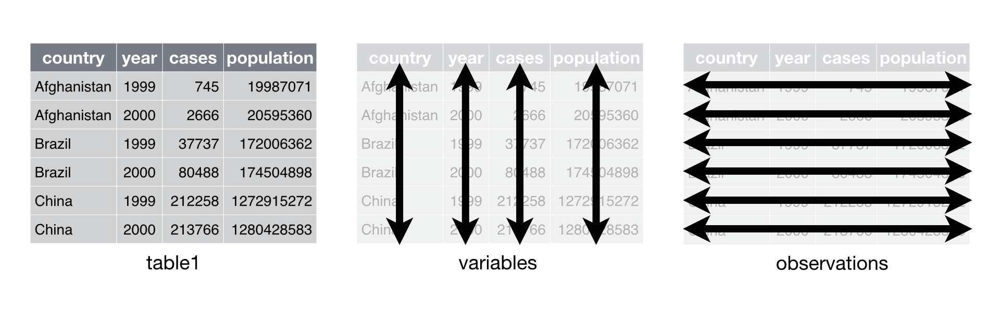
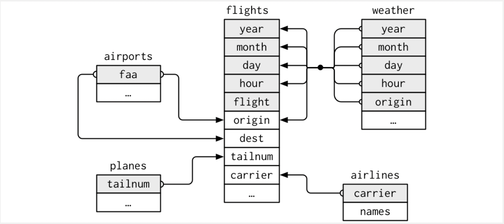
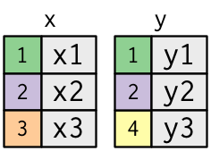
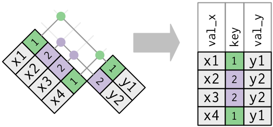
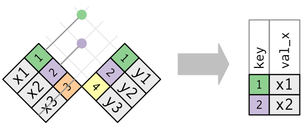
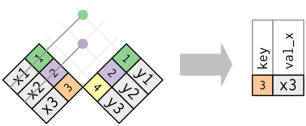

```{r packages_setup, echo=FALSE, message=FALSE, warning=FALSE}
knitr::opts_chunk$set(echo = T, warning = F, message = F)
knitr::opts_chunk$set(fig.width=8, fig.height=6) 
```

class: center, middle, inverse, title-slide

<div class="title-logo"></div>

# Data Analysis and Information Extraction
 
## Topic 3 - Data Wrangling

### 3.2 Data Organization
<br>
<br>
.pull-left[
### Roi Naveiro
#### Academic Year 2026-2027
]
---


## Data Wrangling

**Goal**: get the data ready for later **exploration** and **modeling**

Turn **raw data** into **processed data**

**Raw data**

  - The data exactly as it appears in the original source
  
  - It has not undergone any manipulation
  
**Processed data**

  - Each variable is a column
  
  - Each observation a row
  
  - Each observational unit is a cell
  
  - More complex data, in several interconnected tables
  
---
## Data Wrangling

* Data import
* Data organization
* Data transformation

```{r, echo=FALSE, out.width = '100%',  fig.align='center'}
knitr::include_graphics("img/data-science-wrangle.png")
library(tidyverse)
library(nycflights13)
```


---
class: center, middle, inverse

# Data organization

---

# Tidy data

* We will learn a consistent way of organizing data in R

* We will do so through the `tidyr` package from the `tidyverse` universe

---
# Tidy data

* The same data can be represented in multiple ways
* In the following example we present the values of four variables (*country, year, population, cases*) in four different ways

```{r}
table1
```

---
# Tidy data

* The same data can be represented in multiple ways
* In the following example we present the values of four variables (*country, year, population, cases*) in four different ways

```{r}
table2
```

---
# Tidy data

* The same data can be represented in multiple ways
* In the following example we present the values of four variables (*country, year, population, cases*) in four different ways

```{r}
table3
```

---
# Tidy data

* The same data can be represented in multiple ways
* In the following example we present the values of four variables (*country, year, population, cases*) in four different ways

```{r}
table4a
table4b
```
---
# Tidy data

* Only one of them is **tidy**

* We speak of tidy data if:

  - Each variable corresponds to a column
  - Each row to an observation
  - Each cell to a value
  
```{r, echo=FALSE, out.width = '80%',  fig.align='center'}

```

---
# Tidy data 

* The main advantage is being able to use R's tools, which usually work on vectors of values.

```{r}
table1 %>% mutate(rate = 10000 * cases / population)
```

---
# Tidy data 

* Most of the data we receive is not tidy.

* First step: determine what the variables are and what the observations are. Examples?

* Second step: solve one of these problems

  - A variable is spread across several columns
  - An observation is spread across multiple rows
  
* This is solved with `pivot_longer()` and `pivot_wider()`

---
# `pivot_longer()`

* It is used when a variable is spread across several columns

* Column names are variable values

```{r}
table4a
```

---
# `pivot_longer()`

* We need to **pivot** these columns into a new pair of variables. To do so, we must know:

  - The set of columns to pivot
  - The name of the variable that will receive the columns: `year`
  - The name of the variable that will receive the values: `cases`

---
# `pivot_longer()`

```{r}
table4a %>% pivot_longer(c(`1999`, `2000`), 
                         names_to = "year", values_to = "cases")
```

* Note that the years are names that do not start with a letter and therefore must be surrounded by backticks...

---
# `pivot_longer()`

Use `pivot_longer()` to tidy the `table4b` dataset

---
# `pivot_wider()`

* It is used when we have an observation spread across rows

* In the following dataset, each observation is a country in a year

* Each one takes up two rows

```{r}
table2
```
---
# `pivot_wider()`

To tidy it, we need:

- The column from which we will take the names of the new variables: `type`

- The column from which we will take their values: `count`

---
# `pivot_wider()`

```{r}
table2 %>% 
  pivot_wider(names_from = type, values_from = count)
```

---

# Tidying data

* `pivot_longer`: removes columns and adds rows, makes the data longer.

* `pivot_wider`: removes rows and adds columns, makes the data wider.

---
# Separating and uniting columns

* Sometimes, a single column contains information about two variables.

* It can be split into two columns using `separate()`

```{r}
table3
```
---
# Separating and uniting columns

```{r}
table3 %>% separate(rate, into = c("cases", "population"))
```
---
# Separating and uniting columns

* By default, it separates when it finds a non-alphanumeric character.

* The character can be specified.

```{r}
table3 %>% separate(rate, into = c("cases", "population"), sep = "/")
```

---
# Separating and uniting columns

* In addition, it is advisable to convert the column type, otherwise it will be of string type.

```{r}
table3 %>% separate(rate, into = c("cases", "population"), convert = TRUE)
```
---
# Separating and uniting columns

* It is possible to separate using integers

```{r}
table5 <- 
  table3 %>% separate(year, into = c("century", "year"), sep = 2)
```

---
# Separating and uniting columns

* `unite()` does the opposite of `separate()`: it combines columns
* It takes as arguments:  the new variable, the set of columns to join and `sep`

```{r}
table5 %>% unite(new, century, year, sep = "")
```


---
class: center, middle, inverse

# Relational data

---
# Relational data

* Generally, in data analysis we work with more than one database.

* One of the greatest sources of value in data analysis comes from cross-referencing databases!

* We need to know how to link different data tables.

* When the data is spread across multiple tables, we speak of **relational data**

---
# Keys

* They are **variables** used to connect pairs of tables.

* Two types of keys: Primary Key and Foreign Key

---

# What is a **Primary Key (PK)**?
- It is a column (or combination of columns) that **uniquely identifies** each row in a table.
- It cannot have **duplicate values**.

**Correct example: Customers table**

| customer_id (**PK**) | name  |
|----------------------|-------|
| 1                    | Ana   |
| 2                    | Luis  |
| 3                    | Marta |

---

# What is a **Foreign Key (FK)**?
- It is a column in a table that **refers** to a **primary key (PK)** in another table.
- It can be repeated (**one-to-many** relationship).

**Example: Orders table**

| order_id | customer_id (**FK**) | product  |
|----------|----------------------|----------|
| 1001     | 1                    | Book     |
| 1002     | 2                    | Pencil   |
| 1003     | 1                    | Notebook |

Several orders can belong to the **same customer** (`customer_id = 1`).

---

## Relationship 

A PK and its FK in another table form a **relationship**.

* Normally, **we add information from the table with the Primary Key (PK)**  
* To the **table that has the Foreign Key (FK)**.


| Table with **FK**          | Table with **PK**              |
|----------------------------|--------------------------------|
| Contains **references**    | Contains **unique data**       |
| Needs **more information** | Provides **extra information** |
| Is the **dependent** table | Is the **master** table        |

* Nevertheless, as we will see later, we can do other things.
---

## Example

```{r}
library(dplyr)

customers <- tibble(
  customer_id = c(1, 2, 3),
  name = c("Ana", "Luis", "Marta")
)

orders <- tibble(
  order_id = c(1001, 1002, 1003),
  customer_id = c(1, 2, 1),
  product = c("Book", "Pencil", "Notebook")
)

left_join(orders, customers, by = "customer_id")
```

Everything is fine because customer_id is unique in customers and the join works correctly.


---
# Keys

Once a primary key has been identified, it is useful to check that it is correct

```{r}
planes %>% 
  count(tailnum) %>% 
  filter(n > 1)
```


```{r}
weather %>% 
  count(year, month, day, hour, origin) %>% 
  filter(n > 1)
```

---
# Keys

* Sometimes there are no primary keys! There is no combination of variables that uniquely identifies each observation.

* For example, `flights`.

It is useful to add one... **a surrogate key**

```{r}
flights_key <- flights %>% mutate(key = row_number())
```


```{r}
flights_key %>% 
  count(key) %>% 
  filter(n > 1)
```

---
# Problems if the PK is repeated

If `customer_id` **is repeated** in the `customers` table:

| customer_id (**PK?**) | name   |
|-----------------------|--------|
| 1                     | Ana    |
| 1                     | Alicia |
| 2                     | Luis   |
| 3                     | Marta  |

Remember, the orders table was

| order_id | customer_id (**FK**) | product  |
|----------|----------------------|----------|
| 1001     | 1                    | Book     |
| 1002     | 2                    | Pencil   |
| 1003     | 1                    | Notebook |

---

# Problems if the PK is repeated

**Problem when performing the join**:

```{r, echo=F}
# Customers table with a duplicated primary key
customers <- tibble(
  customer_id = c(1, 1, 2, 3),
  name = c("Ana", "Alicia", "Luis", "Marta")
)

# Orders table
orders <- tibble(
  order_id = c(1001, 1002, 1003),
  customer_id = c(1, 2, 1),
  product = c("Book", "Pencil", "Notebook")
)

```

```{r}
# Join that generates unexpected duplicates
left_join(orders, customers, by = "customer_id")
```


---
# Relational data

In `tidyverse`, there are three families of verbs for working with relational data:

* **Mutating joins**: they add new variables to a data table, coming from matching observations in another table.

* **Filtering joins**: they filter observations from one database based on whether or not they match the observations in another table.

* **Set operations**: they treat observations as if they were elements of a set.

---
# `nycflights13`

We will use this dataset to learn about relational data. It contains the following tables:

* `airlines`:  Airline names

* `airports`: Information about each airport

* `planes`: Information about each plane

* `weather`: Weather information at each NYC airport for every hour

* `flights`: Information about all flights that departed from NYC in 2013

---
# `nycflights13`

```{r, echo=FALSE, out.width = '100%',  fig.align='center'}

```


---
class: center, middle, inverse

# Mutating joins

---

# Mutating joins

* It is used to combine variables from two tables.

* First, it matches observations using the corresponding keys, and then copies
variables from one table to another.

* It adds new variables on the right!! We work with a reduced version

```{r}
flights2 <- flights %>% 
  select(year:day, hour, origin, dest, tailnum, carrier) 
flights2 %>% slice(1:3)
```

---
# Mutating joins

To understand how it works, we work with artificial data

```{r}
x <- tribble(
  ~key, ~val_x,
     1, "x1",
     2, "x2",
     3, "x3"
)
y <- tribble(
  ~key, ~val_y,
     1, "y1",
     2, "y2",
     4, "y3"
)
```

---
# Mutating joins


```{r, echo=FALSE, out.width = '60%',  fig.align='center'}

```

---
# Inner join

It matches observations only when the keys are equal.

```{r, echo=FALSE, out.width = '70%',  fig.align='center'}
knitr::include_graphics("img/join-inner.png")
```

---
# Inner join

The output is a new data frame with key, variable x and variable y. 
Unmatched rows do not appear!!

```{r}
x %>% 
  inner_join(y, by = "key")
```

---
# Outer join

It keeps observations that appear in **at least** one of the datasets!!
Three types:

* **Left join**: keeps all observations from `x`

* **Right join**: keeps all observations from `y`

* **Full join**: keeps all observations from `x` and `y` 

---
# Outer join

```{r, echo=FALSE, out.width = '45%',  fig.align='center'}
knitr::include_graphics("img/join-outer.png")
```

---
# Outer join

Predict the output of the following code

```{r, eval=F}
x %>% 
  left_join(y, by = "key")

x %>% 
  right_join(y, by = "key")

x %>% 
  full_join(y, by = "key")
```

---
# Outer join

Predict the output of the following code

```{r, eval=T}
x %>% 
  left_join(y, by = "key")

x %>% 
  right_join(y, by = "key")
```

---
# Outer join

Predict the output of the following code

```{r, eval=T}
x %>% 
  full_join(y, by = "key")
```


---
# Duplicate keys?

```{r, echo=FALSE, out.width = '55%',  fig.align='center'}

```

* Case 1: Only one table has duplicate keys

* Case 2: Both tables have duplicate keys

---
# Duplicate keys - Case 1

Typical case!

```{r}
x <- tribble(
  ~key, ~val_x,
     1, "x1",
     2, "x2",
     2, "x3",
     1, "x4"
)
y <- tribble(
  ~key, ~val_y,
     1, "y1",
     2, "y2"
)
left_join(x, y, by = "key")
```

---
# Duplicate keys - Case 1


```{r}
left_join(x, y, by = "key")
```

---
# Duplicate keys - Case 2

Error, **the primary key does not uniquely identify the observations**

```{r}
x <- tribble(
  ~key, ~val_x,
     1, "x1",
     2, "x2",
     2, "x3",
     3, "x4"
)
y <- tribble(
  ~key, ~val_y,
     1, "y1",
     2, "y2",
     2, "y3",
     3, "y4"
)
```


---
# Duplicate keys - Case 2

All combinations!

```{r}
left_join(x, y, by = "key")
```

---
# Exercise

Using the `flights` and `airlines` data, create a database containing 
the year, month, day and hour of the flight, as well as the `carrier` variable
which contains the code of the corresponding airline and the
`name` variable which has the full name of the airline.


---
# Defining the keys

* So far, the key was a single variable, with the same name in both
tables.

* Indicated in `by = "key"`

* Other uses of `by`?

---
# Uses of `by`

* `by = NULL` is the default value. It uses all the variables that appear in 
both tables

* Which variables will be used in the following code?

```{r, eval=FALSE}
flights2 %>% 
  left_join(weather)
```

---
# Uses of `by`

* `by = "x"` joins according to the indicated variable(s), with the **same name** in both tables.


```{r, eval=FALSE}
flights2 %>% 
  left_join(planes, by = "tailnum")
```

---
# Uses of `by`

* `by = c("a" = "b")` matches the variable `a` of the first table with the
variable `b` of the second.

* What happens?

```{r, eval=FALSE}
flights2 %>% 
  left_join(airports, c("dest" = "faa"))
```


---
# Exercise

Which variables would you use as a key to join the `planes` and 
`flights` data?

Hint: use the help pages to understand each of the datasets

---
# Exercise

What are the full names of the destination airports with the highest average
delay? Present a table with two columns, one with the full name and 
the other with the average delay.


---
# Mutating joins

**Tip**: use `left_join` whenever you can. It is the most
important function


---
class: center, middle, inverse

# Filtering joins

---
# Filtering joins

Similar to mutating joins, but they affect observations, not variables!
Two types

* `semi_join(x,y)`: keeps all observations from `x` that have a match in
`y`
* `anti_join(x,y)`: removes all observations from `x` that have a match in
`y`

---
# `semi_join(x,y)`

```{r, echo=FALSE, out.width = '65%',  fig.align='center'}

```

---
# `semi_join(x,y)`

Useful for recovering variables after a summary.

**Exercise**: extract all the information for the flights in `flights` whose destination 
is among the 10 destinations with the most observations.

```{r}
top_dest <- flights %>% count(dest) %>% arrange(desc(n)) %>% 
  slice(1:10)
```


---
# `anti_join(x,y)`

```{r, echo=FALSE, out.width = '65%',  fig.align='center'}

```


---
# `anti_join(x,y)`
Useful for diagnosing mismatches.
```{r}
flights %>%
  anti_join(planes, by = "tailnum") %>%
  count(tailnum) %>% arrange(desc(n))
```

---
class: center, middle, inverse
# Set operations


---
# Set operations

They expect `x` and `y` with the **same** variables.
They treat observations as sets:

* `intersect(x,y)`: Returns observations present in both `x` and `y`.

* `union(x,y)`: Returns unique observations present in `x` or `y`.

* `setdiff(x,y)`: Returns observations present in `x` but not in `y`.

---
# Set operations

```{r}
df1 <- tribble(
  ~x, ~y,
   1,  1,
   2,  1
)
df2 <- tribble(
  ~x, ~y,
   1,  1,
   1,  2
)
```


---
# Set operations

```{r}
intersect(df1, df2)

union(df1, df2)

setdiff(df1, df2)
```


---
## Bibliography

This topic is largely based on  [R for Data Science](https://r4ds.had.co.nz/), Wickham and Grolemund (2016)