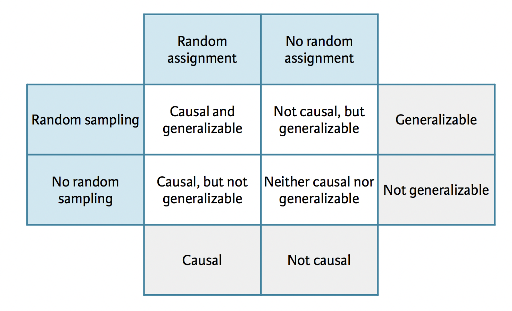
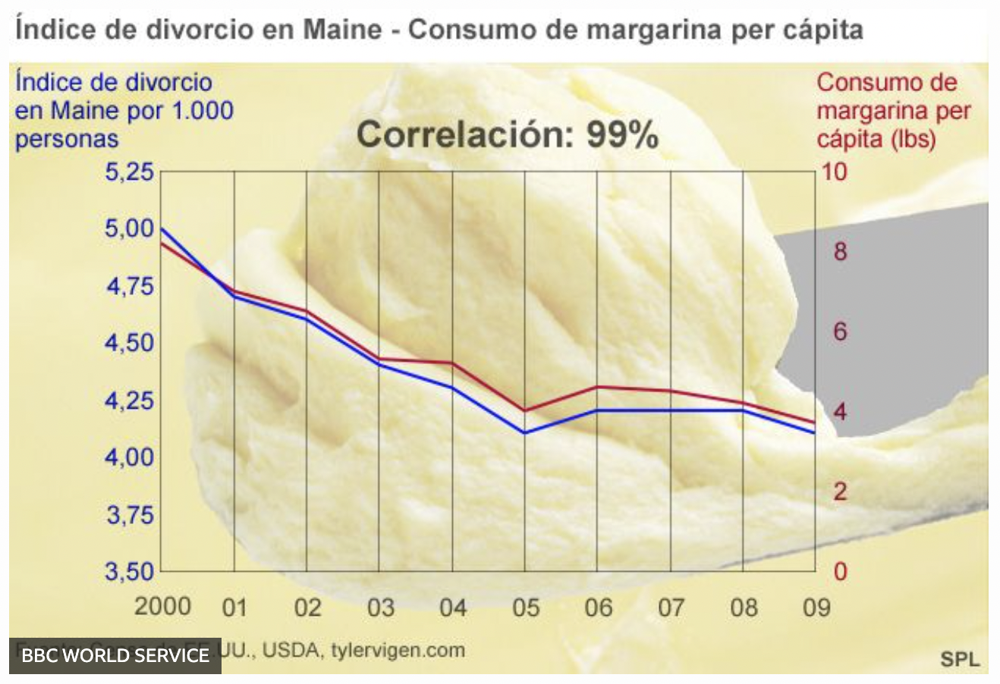
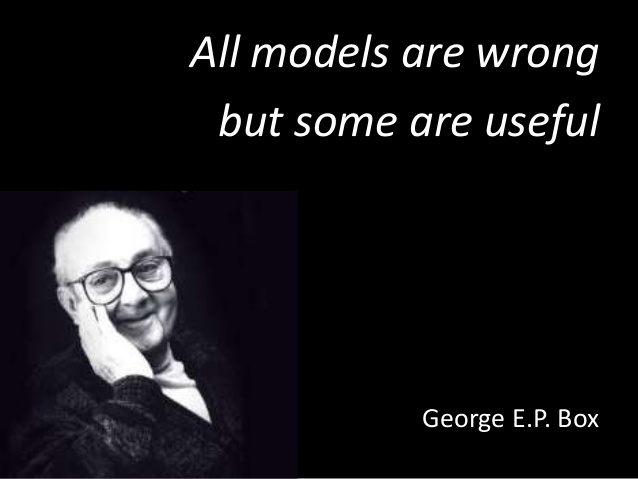

```{r packages_setup, echo=FALSE, message=FALSE, warning=FALSE}
knitr::opts_chunk$set(echo = T, warning = F, message = F)
knitr::opts_chunk$set(fig.width=8, fig.height=6) 
```

class: center, middle, inverse, title-slide

<div class="title-logo"></div>

# Data Analysis and Information Extraction
 
## Topic 4 - Modeling

<br>
<br>
.pull-left[
### Roi Naveiro
#### Academic Year 2026-2027
]
---
## Modeling

Modeling tools have three fundamental goals:

* **Exploring** the data: models sometimes reveal patterns that are not evident in
visualizations (>3D)

* **Generalizing** findings from a sample to a given population (inference)

* Determining **cause-effect relationships** (causal inference)


```{r, echo=FALSE, out.width = '100%',  fig.align='center'}
knitr::include_graphics("img/data-science-model.png")
library(tidyverse)
library(patchwork)
```

---
## Modeling

The patterns discovered by modeling tools can be:

* Association patterns
* Cause-effect relationships

In addition, these patterns can:

* Occur only in the observed data
* Generalize to the population the data come from

---
## Modeling

The way the data are collected affects the kind of generalization of the 
conclusions:

* If we want the conclusions drawn from a sample of data to be generalizable to a
given population, we must sample the subjects **at random** from the population.

```{r, echo=FALSE, out.width = '100%',  fig.align='center'}

```

[Source, in Spanish](https://www.huffingtonpost.es/2016/03/28/troleo-en-la-red-para-bautizar-blas-de-lezo-a-un-buque-brita_n_9556114.html)

---
## Modeling

Does sampling data at random guarantee that the detected patterns are real 
cause-effect relationships?

---
## Study: Cereal Keeps Girls Slim
 
Participants who ate breakfast were observed to have a **lower average body mass index**, a common indicator of obesity, than those who did not eat breakfast. The index was even lower for those who **ate cereal for breakfast**, according to the findings of the **study carried out by the Maryland Medical Research Institute with funding from the NIH and the cereal manufacturer General Mills**.

[...]

The results came from an NIH survey of 2379 women in California, Ohio and Maryland.

[...]

As part of the survey, participants were asked once a year what they had eaten during the previous three days...

[Source](https://www.cbsnews.com/news/study-cereal-keeps-girls-slim/)

---
## Study: Cereal Keeps Girls Slim

There are three possible explanations for this association between eating cereal and having a lower body mass index:

* Eating cereal is the cause of women being slim

* Women being slim is the cause of them eating cereal

* There is a third variable that is the cause of these two, a **confounding variable**

A **confounding variable** is an exogenous variable that is a cause of both the explanatory variable and the response variable, and that makes it look as if a relationship existed between them.

---
## Study: Cereal Keeps Girls Slim

John Kirwan, a professor of medicine at Case Western Reserve University's Schwartz Center for Nutrition and Metabolism, said the findings might be **"more reflective of overall eating habits and quality of food consumed."**

"Those who eat breakfast on a regular basis are **more likely to have a structured eating plan throughout the day** and consequently are less likely to snack between meals and consume empty calories," said Kirwan, who has studied the effect of breakfast consumption on exercise performance and was not involved in the study.

---
## Study: Cereal Keeps Girls Slim

Why is this published?

```{r, echo=FALSE, out.width = '100%',  fig.align='center'}

```

---
## Scientific studies

Depending on the data collection process, we distinguish between studies that are:

* **Observational**

  * Data are collected in a way that does not alter the process that generates them

  * They serve to determine **association**

* **Experimental**

  * Different treatments are assigned to different individuals 

  * To establish **cause-effect** relationships

---
## Scientific studies

```{r, echo=FALSE, out.width = '100%',  fig.align='center'}

```

---
## Correlation does not necessarily imply causation

```{r, echo=FALSE, out.width = '90%',  fig.align='center'}

```

---
## Modeling

Modeling tools have three fundamental goals:

* **Exploring** the data: models sometimes reveal patterns that are not evident in
visualizations (>3D)

* **Generalizing** findings from a sample to the population (inference)

* Determining **cause-effect relationships** (causal inference)

```{r, echo=FALSE, out.width = '100%',  fig.align='center'}
knitr::include_graphics("img/data-science-model.png")
```


---
class: center, middle, inverse

# Models for Exploratory Analysis

---
## Modeling

* In this part of the course, we will introduce basic modeling tools, focusing
on their use as data **exploration techniques**.

* There is nothing wrong with exploration, but you must never sell an exploratory analysis as a confirmatory analysis, because that is **misleading**.

---
## What are statistical models?

* Tools that allow us to extract patterns from the data.

* Patterns vs residuals

* We will study models that relate a series of variables (predictor variables)
to a variable of interest (response variable)

---
## What are statistical models?

A statistical model is a mathematical model that incorporates a set of statistical assumptions concerning the generation of the data of a sample (observations) and of similar data from a larger population. A statistical model represents, often in an idealized form, the data-generating process.

---
## What are statistical models?

* Formally, a statistical model is a pair $(S, \mathcal{P})$: $S$ is the set of possible observations and $\mathcal{P}$ is a family of probability distributions.

* We assume that there is a true probability distribution governing the generation of the data.

* The family of distributions $\mathcal{P}$ is assumed to contain a distribution that adequately approximates the real distribution.

* "A model is a simplification or approximation of reality and hence will not reflect all of reality."

---
## What are statistical models?

* Models are usually parametric: $\mathcal {P}=\{F_{\theta }:\theta \in \Theta \}$

* Given some data, the goal is to find the value of $\theta$ that best fits the data.


---
## What are statistical models?

* We are going to focus on models that relate a response variable to one or more predictor variables.

* These models are known as **regression models**.

* Let us start with a simple example: the response variable is continuous and there is a single predictor variable.

---
## What are statistical models?

```{r}
ggplot(mtcars, aes(x=wt, y=mpg)) + geom_point() + theme_minimal() +
  geom_smooth(method="lm", se=FALSE, color='red')
```

---
## What are statistical models?


* In this case $S = \mathbb{R}^2$. One possibility for $\mathcal{P}$ is the family of linear models:
$$
\mathcal{P} = \{y \sim \mathcal{N}(\beta_0 + \beta_1 x, \sigma^2)\}
$$

* We can also write it as $y = \beta_0 + \beta_1 x + \epsilon$, where $\epsilon \sim \mathcal{N}(0, \sigma^2)$

* This model is known as the **simple linear regression model**.

* What are the parameters of this model?


---
## What are statistical models?

$$
\mathcal{P} = \{y \sim \mathcal{N}(\beta_0 + \beta_1 x, \sigma^2)\}
$$

The simple linear regression model implicitly makes 4 assumptions

1. **Linearity**: the expected value of the response variable corresponds to a linear function of the covariate.

2. Independence of the errors.

3. Homoscedasticity: the variance of the errors is constant.

4. Normality: the errors follow a normal distribution.

In this course we are not going to go into the study of these assumptions, but bear in mind that they exist.

---
## Simple linear regression

* Once we observe data $(x_i, y_i) \in \mathcal{S}$, we can fit the model to find the parameter values that best fit the data.

* The resulting model is called the **fitted model**.


**WATCH OUT**: the best model in the family need not be reality. Models are
simplifications of reality that serve some purpose for us

---
## Simple linear regression

```{r, echo=FALSE, out.width = '100%',  fig.align='center'}

```

---
## Vocabulary

* **Response variable**: variable whose behavior or variation we are trying to understand. Also called the dependent variable. y axis.

* **Explanatory variables**: other variables that you want to use to explain the variation in the response. Also called independent variables, covariates, predictors or *features*. x axis.

* **Predicted value**: output of the **model** for a certain value of the covariates.

---
## Vocabulary

Discuss the elements above in this example.

```{r}
ggplot(mtcars, aes(x=wt, y=mpg)) + geom_point() + theme_minimal() +
  geom_smooth(method="lm", se=FALSE, color='red')
```

---
## Fitting models

```{r}
ggplot(mtcars, aes(x=wt, y=mpg)) + geom_point() + theme_minimal()
```

---
## Fitting models

* The data above show a clear pattern

* We will use a model to capture that pattern and make it explicit

* A simple linear regression model seems reasonable $y = \beta_0 + \beta_1 x + \epsilon$ with $\epsilon \sim \mathcal{N}(0, \sigma^2)$.

* We are going to assume that $\sigma^2$ is known, so the parameters of interest are $\beta_0$ and $\beta_1$.

* There are infinitely many models in this family

---
## Fitting models

```{r}
models <- tibble(
  a1 = runif(250, -20, 40),
  a2 = runif(250, -5, 5)
)

ggplot(mtcars, aes(wt, mpg)) + 
  geom_abline(aes(intercept = a1, slope = a2), data = models, alpha = 1/4) +
  geom_point() + theme_minimal()
```

---
## Fitting models

* Most of these models are **bad**, they do not capture the pattern

* We need to determine which models are **closer** to the data

* One option: use the model that minimizes the sum of the vertical distances from each
point to the model line

---
## Fitting models

```{r, echo=F}
fit <- lm(mpg ~ wt, data = mtcars)
mtcars[,"predicted"] <- predict(fit)

ggplot(mtcars, aes(wt, mpg)) + geom_smooth(method="lm", se=F, color="red") +
  geom_segment(aes(xend = wt, yend = predicted), alpha = .2) +  # alpha 
  geom_point() + theme_minimal()
```


---
## Simple linear regression

To obtain the value of the coefficients using R, we do

```{r}
reg_mod <- lm(mpg ~ wt, data = mtcars)
coef(reg_mod)
```

* The object `mpg ~ wt` is a formula. It is equivalent to 

$$
\text{mpg} = \beta_0 + \beta_1 \cdot \text{wt}
$$

* Intercept is the estimate of the coefficient $\beta_0$ and the other number is the estimate of $\beta_1$


---
## Linear regression

* To estimate the values of $\beta_0$ and $\beta_1$, we use the data.

* We call the estimates $\hat{\beta}_0$ and $\hat{\beta}_1$.

* We call $\hat{y} = \hat{\beta}_0 + \hat{\beta}_1 x$ the predicted value.

* $\hat{\beta}_0$ and $\hat{\beta}_1$ are the values that make the vertical distances seen above minimal

\begin{equation}
\arg \min_{\beta_0, \beta_1} \sum_{i=1}^n [y_i - (\beta_0 + \beta_1 x_i)]^2
\end{equation}

---
## Linear regression

1. Show that the values that minimize the expression above are the maximum likelihood estimators of $\beta_0$ and $\beta_1$.

2. Compute expressions for the estimators of $\beta_0$ and $\beta_1$.

---
## Linear regression

* The estimators $\hat{\beta}_0$ and $\hat{\beta}_1$ have a distribution.

* We can study the distribution of these estimators to obtain their properties: bias, variance, etc.

* As well as compute confidence intervals for these estimators.

* In this course we will not focus on this aspect. We will only work with the point estimates and focus on how to use them to explore the data.

---
## Linear regression - Residuals

The residuals tell us how far each predicted value is from its observed value

$e_i = y_i - \hat{y}_i$

* The estimators $\hat{\beta}_0$ and $\hat{\beta}_1$ are the values that minimize the sum of the squared residuals.

---
## Model visualization

We can visualize:

* The predictions of the models

* The residuals of the models

For this, we use `modelr` from `tidyverse`

---
## Model visualization

* First we create a grid of points of the predictor variable

```{r}
library(modelr)
grid <- mtcars %>% 
  data_grid(wt) 

grid
```

---
## Model visualization

* With the model, we can add predictions

```{r}
reg_mod <- lm(mpg ~ wt, data = mtcars)

grid <- grid %>% 
  add_predictions(reg_mod)

grid
```

---
## Model visualization

```{r}
ggplot(mtcars, aes(wt)) +
  geom_point(aes(y = mpg)) + theme_minimal() +
  geom_line(aes(y = pred), data = grid, colour = "red", size = 1)
```


---
## Model visualization

We add residuals using

```{r}
reg_mod <- lm(mpg ~ wt, data = mtcars)

mtcars <- mtcars %>% add_residuals(reg_mod)
```

---
## Model visualization

```{r}
ggplot(mtcars, aes(wt, resid)) + 
  geom_ref_line(h = 0) +
  geom_point() 
```

---
## Model visualization

* The predictions tell us which pattern we have captured

* The residuals indicate which pattern is left uncaptured

---
## What to do with models?

* **Explanation**: characterize the relationship between $y$ and $x$ through the parameters
$\beta_0$ and $\beta_1$

* **Prediction**: for a new value of $x$, obtain its $y$ value

---
## Interpreting linear regression

Let us go back to the previous regression. The `broom` library from tidyverse serves to 
tidy the results of `lm`. **WATCH OUT**: it is not loaded automatically when loading `tidyverse`.

```{r}
library(broom)
mod_reg <- lm(mpg ~ wt, data=mtcars)
tidy(mod_reg)
```

---
## Interpreting linear regression - Slope

The linear regression model is

$$
\widehat{ \text{mpg} } = \beta_0 + \beta_1 \text{wt}  
$$

Let us increase wt by one unit

\begin{eqnarray}
&& \beta_0 + \beta_1 ( \text{wt} + 1) = \\
&& \beta_0 + \beta_1 \text{wt} + \beta_1 = \\
&& \widehat{ \text{mpg} } + \beta_1
\end{eqnarray}

How is $\beta_1$ interpreted?

---
## Interpreting linear regression - Intercept

The linear regression model is

$$
\widehat{ \text{mpg} } = \beta_0 + \beta_1 \text{wt}
$$

We substitute zero for wt

\begin{eqnarray}
\widehat{ \text{mpg} } = \beta_0 + \beta_1 \times 0 = \beta_0
\end{eqnarray}

How is $\beta_0$ interpreted?

---
## Interpreting Linear Regression

We are going to model how years of experience affect a teacher's salary

```{r}
library(openintro)
data("teacher")
set.seed(1)
grade <- sample(c(rep("elementary", 20), rep("middle", 25), rep("high", 26)))
teacher <- teacher %>%
  mutate(degree = factor(degree, c("MA","BA")),
         grade = grade)
```

---
## Interpreting Linear Regression

We are going to model how years of experience affect a teacher's salary

```{r}
ggplot(teacher, aes(x=years, y=base)) + geom_point() + theme_minimal()
```

---
## Interpreting Linear Regression

Fit a linear model, obtain the coefficients and interpret them.

Determine the predicted salary of a teacher with 15 years of experience.

---
## Interpreting Linear Regression

```{r}
ggplot(teacher, aes(x=years, y=base)) + geom_point() +
  geom_smooth(method="lm", color='red', se=FALSE) + theme_minimal()
```


---
## Linear Regression: Categorical Predictors

* So far we have considered $x$ to be continuous. What happens if it is categorical?

* Suppose that $x$ refers to gender and takes two values: male and female.

* $y = \beta_0 + \beta_1 x + \epsilon$ would not make sense, $x$ is not a number!

* We can write $y = \beta_0 +\beta_1 \text{gender}\_\text{male} + \epsilon$, where $\text{gender}\_\text{male}$ takes value 1 for men and zero for women. 

---
## Linear Regression: Categorical Predictors

* Salary versus degree. What levels does the degree variable have?

* We fit a model

```{r}
mod_base_degree <- lm(base ~ degree, data=teacher)
tidy(mod_base_degree)
```

---
## Linear Regression: Categorical Predictors

* R has created an **indicator variable**  degreeBA: if the degree is BA it takes value 1,
otherwise 0.

* If the variable had three levels A, B and C, R would create two indicator variables, e.g. for A and B.

* The base level is the level the variable takes when all the indicators are 0.

* The coefficients are interpreted with respect to the base level.


---
## Linear Regression: Categorical Predictors

```{r}
mod_base_degree <- lm(base ~ degree, data=teacher)
tidy(mod_base_degree)
```
Interpret each coefficient

---
## Linear Regression: Visualizing the predictions

```{r}
mod_base_degree <- lm(base ~ degree, data=teacher)

grid <- teacher %>% 
  data_grid(degree) %>% 
  add_predictions(mod_base_degree)
grid
```

---
## Linear Regression: Visualizing the predictions

```{r}
ggplot(teacher, aes(x=degree)) + geom_point(aes(y=base)) + theme_minimal() +
  geom_point(data = grid, aes(y = pred), colour = "red", size = 4)
```

---
## Linear Regression: Visualizing the predictions

We predict the mean for each group!

---
## Multiple Linear Regression

* On many occasions, we have more than one predictor variable.

* The simplest linear model for this case is **multiple linear regression**

\begin{equation}
y_i = \textbf{x}_i^\top\boldsymbol{\beta} + \epsilon = \beta_{0} + \beta_1 x_{i1} + \beta_2 x_{i2} + \dots + \beta_p x_{ip} + \epsilon
\end{equation}

* The effects of different covariates on the expected value of the dependent variable are additive.

---
## Multiple Linear Regression - Interpretation

* How is $\beta_0$ interpreted? 

* How is $\beta_1$ interpreted? 

* ...

* How is $\beta_p$ interpreted?

---
## Multiple Linear Regression 

In R

```{r}
mod_reg <- lm(base ~ years + degree, data = teacher)
tidy(mod_reg)
```

---
## Multiple Linear Regression 

We visualize the predictions

```{r}
grid <- teacher %>% 
  data_grid(years, degree) %>% 
  add_predictions(mod_reg)
grid
```

---
## Multiple Linear Regression 

We visualize the predictions

```{r}
ggplot(teacher, aes(years, base, colour = degree)) + 
  geom_point() + 
  geom_line(data = grid, aes(y = pred)) + theme_minimal()

```


---
## Multiple Linear Regression

How do you interpret the coefficients?


---
class: center, middle, inverse

# Inference 

---

## Terminology

.vocab[Population]: group of individuals to be studied

.vocab[Parameter]: numerical quantity derived from the population
(almost always unknown)

If we had data on every unit of the population, we could simply compute
the population parameter and that would be it!

--

**Unfortunately, in general we cannot do this. 
Instead, we work with**

.vocab[Sample]: a subset of our population of interest

.vocab[Statistic]: a numerical quantity derived from a sample


---

## Inference

If the sample is .vocab[representative] (chosen at random from the population of interest), then we can use 
probability and statistical inference to draw
conclusions that are .vocab[generalizable] to the population of interest.


---

## Statistical inference

.vocab[Statistical inference] is the process that allows us, through
data from a sample, to draw conclusions about the population the sample
comes from.

- .vocab[Estimation]: use the sample to estimate a plausible range of 
values of an unknown population parameter

- .vocab[Hypothesis test]: assess whether the observed sample provides evidence 
for or against some claim about the population

We will focus on **estimation**.

---

class: center, middle

# Estimation

---

## We travel to Asheville! 

```{r echo=FALSE,out.width=450, fig.align="center"}

```

**How much should we expect to pay for an Airbnb in Asheville?**


---

## Asheville data

[Inside Airbnb](http://insideairbnb.com/) scraped all the Airbnb listings in 
Asheville, NC, that were active on 25 June 2020.

**Population of interest**: Airbnbs in Asheville with at least ten reviews.

**Parameter of interest**: Average price per guest per night in these 
Airbnbs.


.question[
What is the average price per guest per night of the Airbnb rentals in June 2020, 
with at least ten reviews, in Asheville (zip codes 28801 - 28806)?
]

We have data on the price per guest (`ppg`) for a random sample of 50 Airbnb listings.


---

## Point estimation

A .vocab[point estimate] is a single value computed from the sample 
data to serve as the "best estimate" of the population parameter.

Our point estimate for the average price per guest in the population is 
the mean observed in the sample:

```{r}
abb <- read_csv("data/asheville.csv")
abb %>% 
  summarize(mean_price = mean(ppg))
```

---

## Visualizing our sample

```{r, echo = F, out.width = "80%"}
ggplot(data = abb, aes(ppg)) +
  geom_histogram(binwidth = 25,
                 color = "darkblue",
                 fill = "skyblue") +
  labs(title = "Right-skewed distribution of the price per guest",
       x = "Price per guest per night ($)",
       y = "Count") +
  scale_y_continuous(breaks = seq(0, 20, by = 5)) + 
  ylim(0, 20) +
  theme_minimal()
```

---

## Point estimate?

.question[
If you want to estimate a population parameter, would you rather report a range of values in which the parameter might lie, or a single value?
]


--

- If we only provide a point estimate, we will probably not hit 
the true value of the population parameter exactly.

- If we provide a range of plausible values,
we have a higher probability of capturing the true value of the parameter.


---

class: middle, center

## Confidence intervals

---

## Variability of the sample statistics

To build a confidence interval for the population mean, 
we need to create a range of plausible values around the observed sample mean.

- Remember that random samples can differ from one another. If we took another
random sample of 50 Airbnb listings in Asheville, we would probably not obtain the same
mean price per guest.

--

- There is a certain .vocab[variability] in the sample mean.

- To build a confidence interval, we must quantify this variability. This
gives us a measure of how much we expect the sample mean to vary from
sample to sample.


---

## Quantifying the variability

We can quantify the variability of the sample statistics through different approaches:

- **Simulation**: through techniques such as "bootstrap" or "resampling" (**what we will do here**)

or

- **Theory**: through the Central Limit Theorem

---

class: center, middle

# Bootstrapping

---

## The bootstrap principle


- The term .vocab[bootstrap] comes from the phrase "to pull oneself up 
by one's own 
bootstraps", which is a metaphor for accomplishing an impossible task without 
any outside help.

- In this case, the impossible task is estimating a population parameter, and we 
will accomplish it using data from the given sample only.

- This notion of saying something about a population parameter using 
only information from an observed sample is the essence of statistical inference;
it is not limited to the bootstrap.

---

## The bootstrap procedure

1. Take a .vocab[bootstrap sample] - a random sample drawn **with replacement**
from the original sample, **of the same size** as the original sample.

2. Compute the .vocab[bootstrap statistic]:  the statistic of interest (the 
mean, the median, the correlation, etc.) using the bootstrap sample.

3. Repeat steps (1) and (2) many times to create a .vocab[bootstrap distribution] - a distribution of bootstrap statistics.

4. Compute the bounds of the XX% confidence interval as the region that holds the
XX% of the bootstrap distribution.

---

## The original sample

<br><br>

```{r, echo = F, out.width = "70%"}
mean0 <- round(mean(abb$ppg),3)
ggplot(data = abb, aes(ppg)) +
  geom_histogram(binwidth = 25,
                 color = "darkblue",
                 fill = "skyblue") +
  labs(caption = paste0("Original sample: mean = ", mean0),
       x = "Price per guest per night",
       y = "Count") +
  scale_y_continuous(breaks = seq(0, 20, by = 5)) + 
  ylim(0, 20) +
  scale_x_continuous(breaks = seq(0, 250, by = 50)) + 
  xlim(0, 250) +
  geom_vline(xintercept = mean(abb$ppg), lwd = 2, color = "red") + 
  theme_minimal()
```

---

## Step by step

**Step 1.** Take a .vocab[bootstrap sample]: a random sample drawn 
**with replacement** from the original sample, **of the same size** as the 
original sample:


```{r, echo = F, out.width = "70%"}
set.seed(1)
indices <- sample(1:nrow(abb), 50, replace = T)
boot_samp_1 <- abb %>% 
  slice(indices)
```

```{r, echo = F, out.width = "70%"}
ggplot(data = boot_samp_1, aes(ppg)) +
  geom_histogram(binwidth = 25,
                 color = "darkblue",
                 fill = "skyblue") +
  labs(caption = "Bootstrap sample 1",
       x = "Price per guest per night",
       y = "Count") +
  scale_y_continuous(breaks = seq(0, 20, by = 5)) + 
  ylim(0, 20) +
  scale_x_continuous(breaks = seq(0, 250, by = 50)) + 
  xlim(0, 250) +
# geom_vline(xintercept = mean(boot_samp_1$ppg), lwd = 2, color = "red") + 
  theme_minimal()
```


---

## Step by step

**Step 2.** Compute the bootstrap statistic (in this case, the sample mean) 
using the bootstrap sample:


```{r, echo = F, out.width = "70%"}
mean1 <- round(mean(boot_samp_1$ppg), 3)
ggplot(data = boot_samp_1, aes(ppg)) +
  geom_histogram(binwidth = 25,
                 color = "darkblue",
                 fill = "skyblue") +
  labs(caption =  paste0("Bootstrap sample 1: mean = ", mean1),
       x = "Price per guest per night",
       y = "Count") +
  scale_y_continuous(breaks = seq(0, 20, by = 5)) + 
  ylim(0, 20) +
  scale_x_continuous(breaks = seq(0, 250, by = 50)) + 
  xlim(0, 250) + 
  geom_vline(xintercept = mean(boot_samp_1$ppg), lwd = 2, color = "red") + 
  theme_minimal()
```

---

## Step by step

**Step 3.** Repeat steps 1 and 2 several times to create a bootstrap distribution 
of sample means:

.pull-left[
```{r, echo = F}
set.seed(1)
temp <- abb %>% slice(sample(1:50, replace = T))
samp1 <- ggplot(data = temp, aes(ppg)) +
  geom_histogram(binwidth = 25, color = "darkblue", fill = "skyblue") +
  labs(x = "", y = "") +
  scale_y_continuous(breaks = seq(0, 20, by = 5)) + 
  ylim(0, 20) +
  scale_x_continuous(breaks = seq(0, 250, by = 50)) + 
  xlim(0, 250) +
  geom_vline(xintercept = mean(temp$ppg), lwd = 1, color = "red") + 
  theme_minimal()
```
```{r, echo = F}
set.seed(2)
temp <- abb %>% slice(sample(1:50, replace = T))
samp2 <- ggplot(data = temp, aes(ppg)) +
  geom_histogram(binwidth = 25, color = "darkblue", fill = "skyblue") +
  labs(x = "", y = "") +
  scale_y_continuous(breaks = seq(0, 20, by = 5)) + 
  ylim(0, 20) +
  scale_x_continuous(breaks = seq(0, 250, by = 50)) + 
  xlim(0, 250) +
  geom_vline(xintercept = mean(temp$ppg), lwd = 1, color = "red") + 
  theme_minimal()
```
]

.pull-right[
```{r, echo = F}
set.seed(3)
temp <- abb %>% slice(sample(1:50, replace = T))
samp3 <- ggplot(data = temp, aes(ppg)) +
  geom_histogram(binwidth = 25, color = "darkblue", fill = "skyblue") +
  labs(x = "", y = "") +
  scale_y_continuous(breaks = seq(0, 20, by = 5)) + 
  ylim(0, 20) +
  scale_x_continuous(breaks = seq(0, 250, by = 50)) + 
  xlim(0, 250) +
  geom_vline(xintercept = mean(temp$ppg), lwd = 1, color = "red") + 
  theme_minimal()
```

```{r, echo = F}
set.seed(4)
temp <- abb %>% slice(sample(1:50, replace = T))
samp4 <- ggplot(data = temp, aes(ppg)) +
  geom_histogram(binwidth = 25, color = "darkblue", fill = "skyblue") +
  labs(x = "", y = "") +
  scale_y_continuous(breaks = seq(0, 20, by = 5)) + 
  ylim(0, 20) +
  scale_x_continuous(breaks = seq(0, 250, by = 50)) + 
  xlim(0, 250) +
  geom_vline(xintercept = mean(temp$ppg), lwd = 1, color = "red") + 
  theme_minimal()
```
]

```{r echo = F, out.width="80%"}
(samp1 + samp2)/(samp3 + samp4)
```

---

## Step by step

**Step 3.** In this plot, we have taken 500 bootstrap samples, computed the
sample mean for each one and represented them in a histogram:

```{r, echo = F, out.width = "70%"}
boot_dist <- tibble(boot_mean = numeric(500))
for(i in 1:500){
  set.seed(i)
  indices <- sample(1:50, replace = T)
  boot_dist$boot_mean[i] <- mean(abb$ppg[indices])
}
ggplot(data = boot_dist, aes(boot_mean)) +
  geom_histogram(binwidth = 5, color = "darkred", fill = "pink") +
  labs(x = "", y = "", title = "Bootstrap distribution of sample means") +
  scale_x_continuous(breaks = seq(0, 250, by = 50)) + 
  xlim(0, 250) +
  theme_minimal()
```


---

**Here we compare the bootstrap distribution of the sample means with the distribution of the original data. What do you observe?**

```{r, echo = F}
boot_dist <- tibble(boot_mean = numeric(500))
for(i in 1:500){
  set.seed(i)
  indices <- sample(1:50, replace = T)
  boot_dist$boot_mean[i] <- mean(abb$ppg[indices])
}
p1 <- ggplot(data = abb, aes(ppg)) +
  geom_histogram(binwidth = 25,
                 color = "darkblue",
                 fill = "skyblue") +
  labs(x = "", y = "", title = "Original sample") +
  scale_y_continuous(breaks = seq(0, 20, by = 5)) + 
  ylim(0, 20) +
  scale_x_continuous(breaks = seq(0, 250, by = 50)) + 
  xlim(0, 250) +
  geom_vline(xintercept = mean(abb$ppg), lwd = 2, color = "red") + 
  theme_minimal() +
  theme(axis.title.y=element_blank(),
        axis.text.y=element_blank(),
        axis.ticks.y=element_blank())
p2 <- ggplot(data = boot_dist, aes(boot_mean)) +
  geom_histogram(binwidth = 5, color = "darkred", fill = "pink") +
  labs(x = "", y = "", title = "Bootstrap distribution of sample means") +
  scale_x_continuous(breaks = seq(0, 250, by = 50)) + 
  xlim(0, 250) +
  theme_minimal() +
  theme(axis.title.y=element_blank(),
        axis.text.y=element_blank(),
        axis.ticks.y=element_blank())
p1 / p2
```

---

## Step by step

**Step 4.** Compute the bounds of the bootstrap interval using percentiles of the bootstrap distribution

```{r, echo = F, out.width = "70%"}
boot_dist <- tibble(boot_mean = numeric(500))
for(i in 1:500){
  set.seed(i)
  indices <- sample(1:50, replace = T)
  boot_dist$boot_mean[i] <- mean(abb$ppg[indices])
}
ggplot(data = boot_dist, aes(boot_mean)) +
  geom_histogram(binwidth = 5, color = "darkred", fill = "pink") +
  labs(x = "", y = "", title = "Bootstrap distribution of sample means",
       subtitle = "95% confidence interval bounds") +
  scale_x_continuous(breaks = seq(0, 250, by = 50)) + 
  xlim(0, 250) +
  geom_vline(xintercept = quantile(boot_dist$boot_mean, 0.025), 
             lwd = 1, color = "black") +
  geom_vline(xintercept = quantile(boot_dist$boot_mean, 0.975), 
             lwd = 1, color = "black") +
  theme_minimal()
```

---

class: center, middle

# Bootstrapping in R

---

## The `infer` package

.pull-left[

]

.pull-right[
<br/><br/><br/><br/>
The goal of the infer package is to perform statistical inference using a
grammar that integrates with the tidyverse design framework.

```{r}
library(infer)
```

<br><br>
[infer.netlify.com](http://infer.netlify.com)
]

---

## Choose a seed


```{r}
set.seed(123)
```

The `set.seed()` function is a base R function that allows us to control random number generation in R. Use it to make your simulation reproducible.

In other words, it ensures that we will obtain the same random sample every time we run the code or knit.

---

## Generating bootstrap means

```{r eval=FALSE}
abb %>%
  # specify the variable of interest
  specify(response = ppg) #<<
```

- `specify()` is used to specify which variable in our dataset is the
relevant response variable (that is, the variable on which we are going to do the
bootstrap).


---

## Generating bootstrap means

```{r eval=FALSE}
abb %>%
  # specify the variable of interest
  specify(response = ppg) %>% 
  # generate 15000 bootstrap samples
  generate(reps = 15000, type = "bootstrap") #<<
```

- `generate()` generates the bootstrap means

---

## Generating bootstrap means

```{r eval=FALSE}
abb %>%
  # specify the variable of interest
  specify(response = ppg) %>% 
  # generate 15000 bootstrap samples
  generate(reps = 15000, type = "bootstrap") %>% 
  # calculate the statistic of each bootstrap sample
  calculate(stat = "mean") #<<
```

- `calculate()` computes the sample statistic. In this case we use the mean, but we could compute, for example,
the bootstrap medians.


---

## Generating bootstrap means

```{r include=FALSE}
set.seed(834782)
```

```{r}
num_reps <- 100
```

```{r}
# save resulting bootstrap distribution
boot_dist <- abb %>% #<<
  # specify the variable of interest
  specify(response = ppg) %>% 
  # generate 100 bootstrap samples
  generate(reps = num_reps, type = "bootstrap") %>% 
  # calculate the statistic of each bootstrap sample
  calculate(stat = "mean")
```

---

## Sample means


How many observations are there in `boot_dist`? What does each observation represent?

--

```{r}
boot_dist
```

---

## Visualizing the distribution

```{r echo=FALSE}
ggplot(data = boot_dist, mapping = aes(x = stat)) +
  geom_histogram(binwidth = 5) +
  labs(title = "Bootstrap distribution centered around 75",
       x = "Price per guest", y = "Count", caption = "Binwidth of 5") +
  theme_minimal()
```

---

## Computing the confidence interval

A 95% confidence interval contains the central 95% of the bootstrap distribution. To obtain the central 95%, we want to leave out 2.5% on the left and 2.5% on the right.


--

Using `dplyr`:

```{r}
ci <- boot_dist %>%
  summarise(lower_b = quantile(stat, 0.025), 
            upper_b = quantile(stat, 0.975))
ci
```

---

## Visualizing a confidence interval (Option 1)

Using `geom_vline()` to mark the bounds of the confidence interval


```{r eval = F, out.width = "75%"}
ggplot(data = boot_dist, mapping = aes(x = stat)) + #<<
  geom_histogram(binwidth = 5, alpha = .5) +
  geom_vline(xintercept = ci$lower_b, #<<
             color = "steelblue", lty = 2, size = 1) + 
  geom_vline(xintercept = ci$upper_b, #<<
             color = "steelblue", lty = 2, size = 1) +
  labs(title = "Bootstrap distribution of the mean price per guest",
       subtitle = "with 95% CI",
       x = "Means", y = "Count") +
  theme_minimal()
```

---

## Visualizing a confidence interval (Option 1)


```{r echo=FALSE, out.width = "75%"}
ggplot(data = boot_dist, mapping = aes(x = stat)) + #<<
  geom_histogram(binwidth = 5, alpha = .5) +
  geom_vline(xintercept = ci$lower_b, #<<
             color = "steelblue", lty = 2, size = 1) + 
  geom_vline(xintercept = ci$upper_b, #<<
             color = "steelblue", lty = 2, size = 1) +
  labs(title = "Bootstrap distribution of the mean price per guest",
       subtitle = "with 95% CI",
       x = "Means", y = "Count") +
  theme_minimal()
```

---

## Visualizing a confidence interval (Option 2)

```{r eval = F, out.width = "75%"}
visualize(boot_dist) + #<<
  shade_confidence_interval(endpoints = ci)+ #<<
  labs(title = "Bootstrap distribution of the mean price per guest",
       subtitle = "with 95% CI",
       x = "Means", y = "Count") 
```
---

## Visualizing a confidence interval (Option 2)

```{r echo = F, out.width = "75%"}
visualize(boot_dist) + #<<
  shade_confidence_interval(endpoints = ci)+ #<<
  labs(title = "Bootstrap distribution of the mean price per guest",
       subtitle = "with 95% CI",
       x = "Means", y = "Count") 
```
---


## Interpreting a confidence interval

Our 95% confidence interval (CI) is 
(`r round(ci$lower_b, 1)`, `r round(ci$upper_b, 1)`).

.question[
Does this mean that there is a 95% probability that the population mean price per night is contained in the interval (`r round(ci$lower_b, 1)`, `r round(ci$upper_b, 1)`)? 
]

---

class: center, middle

.question[
**No!**
]

---

## Interpreting a confidence interval

- The population parameter either is or is not in our interval. It cannot have a "95% probability" of being in some specific interval.

--

- The bootstrap distribution captures the variability of the sample mean, but it is based on our original sample. If we started with a different sample, our estimated 95% confidence interval  might be different.

--

- All we can say is that, if we took repeated independent samples from this population and computed a 95% CI for the mean in the same way, then we would *expect* 95% of these intervals to contain the population mean.

--

- However, we never know whether any particular interval actually does!

---

## Interpretation 

.question[
**We are 95% confident that the mean price per guest per night for Airbnbs in Asheville, NC is between `r round(ci$lower_b,1)` and `r round(ci$upper_b,1)` dollars.**
]

---
## Theoretical foundations: intuition 

- We assume that our data come from an unknown distribution $F$.  
- From the observed sample, we build the **empirical distribution** $\hat{F}$, which basically assigns the same probability to each observed data point.  
- The **bootstrap** consists of taking many samples with replacement from $\hat{F}$, which, intuitively, “simulates” sampling from $F$ again.  
- By recomputing the statistic of interest on each bootstrap sample, we obtain an approximation of how that statistic would vary if we really took new samples from the original population.

---

## Theoretical foundations: why it works

- **Main idea**: In large samples, $\hat{F}$ gets closer and closer to $F$.  
  - (Law of Large Numbers / Consistency of the empirical distribution).  
- **Consequence**: Sampling from $\hat{F}$ mimics the act of sampling from $F$ well enough.  
- **Bootstrap**:  
  - It generates the **bootstrap distribution** of the estimator, which (under reasonable conditions) approximates the real distribution that estimator would have if we sampled repeatedly from the population.  
  - This approximation makes it possible to estimate standard errors, confidence intervals, etc., **without** knowing $F$ or resorting to complicated formulas.


---

## Theoretical foundations: why it works

**Conclusion**: Even though we are “inventing” data by sampling from $\hat{F}$, it turns out that, when $n$ is large, this procedure is **statistically reliable** and converges to the same answer we would obtain from $F$.


---
## Bibliography

This topic is largely based on  [R for Data Science](https://r4ds.had.co.nz/), Wickham and Grolemund (2016)