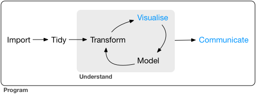
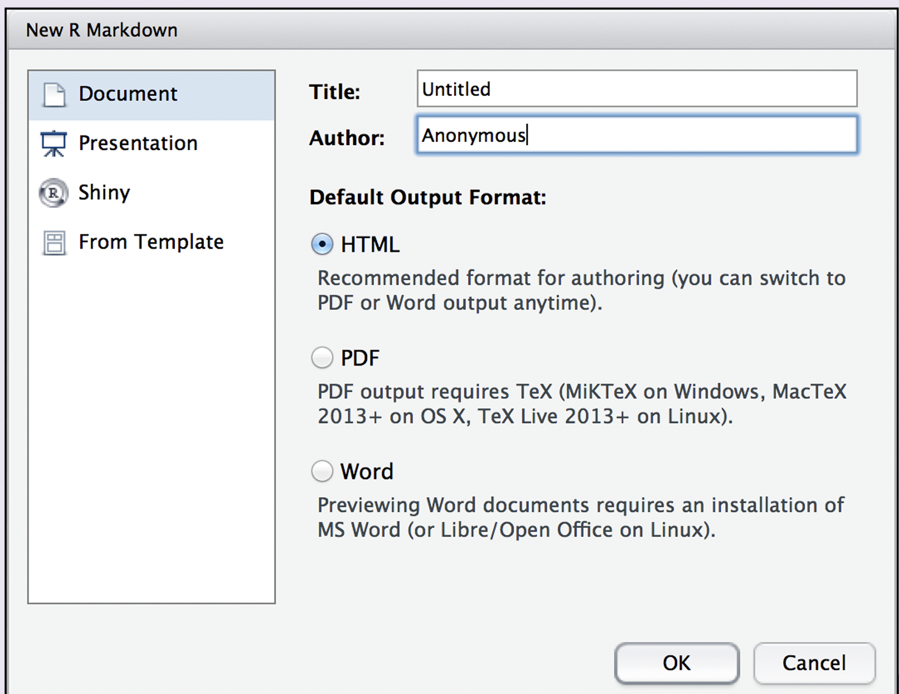
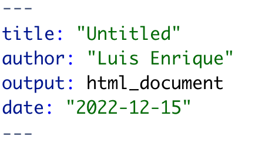
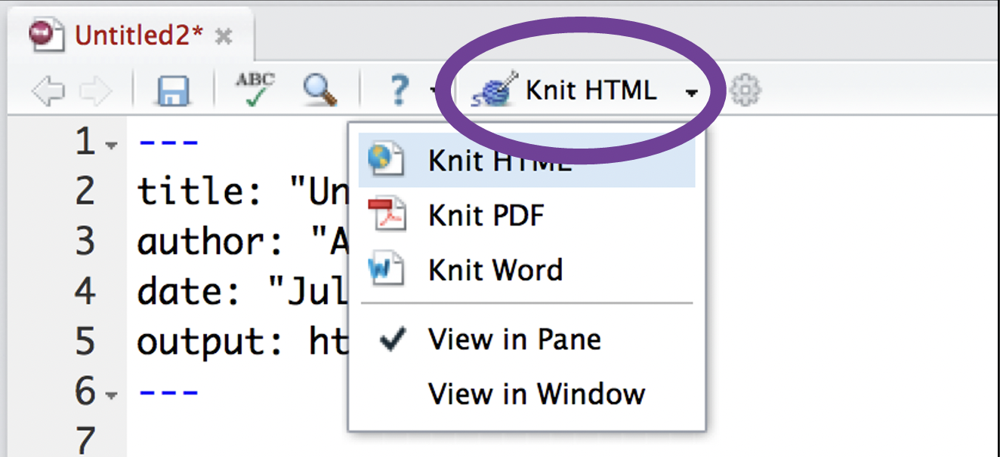
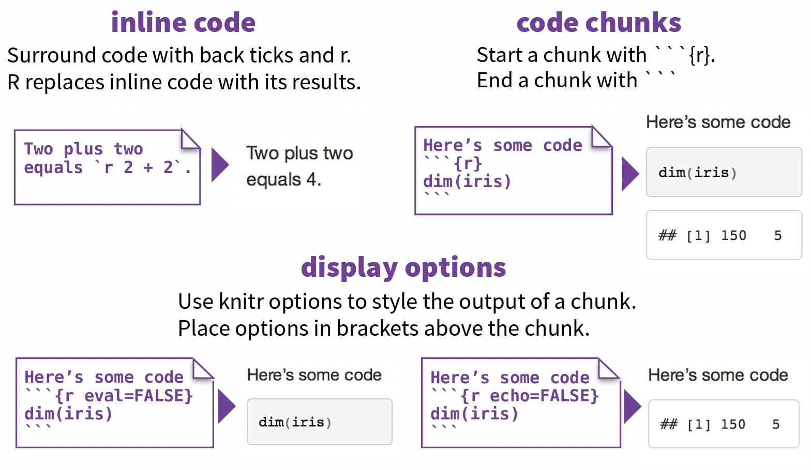

```{r packages_setup, echo=FALSE, message=FALSE, warning=FALSE}
knitr::opts_chunk$set(echo = T, warning = F, message = F)
knitr::opts_chunk$set(fig.width=8, fig.height=6) 
```

class: center, middle, inverse, title-slide

<div class="title-logo"></div>

# Data Analysis and Information Extraction
 
## Topic 5 - Communication of Results

<br>
<br>
.pull-left[
### Roi Naveiro
#### Academic Year 2026-2027
]
---
## Reports

We will learn how to produce reports in R Markdown

```{r, echo=FALSE, out.width = '100%',  fig.align='center'}

library(tidyverse)
```


---
## RMD

R Markdown is a format for writing reproducible reports with R. It is used to embed R code and results in slide presentations, PDF files, html documents, etc. To produce a report:

1. Open an Rmd file
2. Write **content**
3. Include **code**
4. Render it in the format you want

---
## Opening an RMD file

* **File** - **New File** - **R Markdown...**

```{r, echo=FALSE, out.width = '60%',  fig.align='center'}

library(tidyverse)
```

* Choose the format you need: pdf or html for this course.

---
## Filling in the header

```{r, echo=FALSE, out.width = '70%',  fig.align='center'}

library(tidyverse)
```

* `output: pdf_document`: for PDF
* `output: html_document`: for HTML

---
## Rendering

* To render

```{r, echo=FALSE, out.width = '70%',  fig.align='center'}

```

---
## Rendering

When you render, R does the following:

* It runs every embedded code chunk and inserts the results into the report 

* It builds a new version of the report in the output file type

* It opens a preview of the output file 

* It saves the output file in your **working directory**

* **INSTALL tinytex FOR PDF**!!!!

---
## Writing content

Very simple, just a few rules

`# Title`
# Title

`## Subtitle`
## Subtitle

`### Sub-subtitle`
### Sub-subtitle

---
## Writing content

`**Bold**`
**Bold**

`*Italics*`
*Italics*

`[link](www.rstudio.com)`
[link](www.rstudio.com)   

---
## Writing content

`*` Bullets

* Bullets

`1.` Numbered list

1. Numbered list 

2. Blah 

---
## Writing code

**Always inside a code chunk**

```{r, echo=FALSE, out.width = '80%',  fig.align='center'}

```

---
## Writing code

* `echo = FALSE`: the code is evaluated and its output is shown, but the code chunk is not shown

* `eval = FALSE`: the code is NOT evaluated and its output is NOT shown, but the code chunk IS shown

* By default, both are `TRUE`
---

## Bibliography

This topic is based on  [Rmd Cheat Sheet](https://www.rstudio.com/wp-content/uploads/2015/02/rmarkdown-cheatsheet.pdf)